[toc]
>SpringBoot整合RabbitMQ

# 1 RabbitMQ简介
RabbitMQ是一个开源的AMQP（Advanced Message Queuing Protocol）消息中间件，由Erlang语言编写。

了解RabbitMQ前，我们先了解什么是MQ。

## 1.1 MQ
MQ（Message Queue）消息队列，是一个消息的缓冲池，消息的发送者（Producer）将消息发送到消息队列，消息的接收者（Consumer）从消息队列中取出消息。

MQ的主要作用是：
1. 降低系统耦合度。
2. 流量削峰填谷。
3. 异步处理。

## 1.2 常用的消息中间件
现在实现MQ的有两种主流方式：AMQP、JMS。

AMQP，即Advanced Message Queuing Protocol，一个提供统一消息服务的应用层标准高级消息队列协议，是应用层协议的一个开放标准，为面向消息的中间件设计。基于此协议的客户端与消息中间件可传递消息，并不受客户端/中间件不同产品，不同的开发语言等条件的限制。Erlang中的实现有RabbitMQ等。

JMS即Java消息服务（Java Message Service）应用程序接口，是一个Java平台中关于面向消息中间件（MOM）的API，用于在两个应用程序之间，或分布式系统中发送消息，进行异步通信。Java消息服务是一个与具体平台无关的API，绝大多数MOM提供商都对JMS提供支持。

## 1.3 AMQP和JMS的区别
AMQP和JMS都是消息中间件，但是它们在消息传递方面存在一些差异。AMQP是一种应用层协议，JMS是Java平台中提供的API。AMQP支持多种消息传递模式，如点对点、发布/订阅等，而JMS只支持点对点模式。AMQP
支持多种传输协议，如TCP、UDP、HTTP等。

## 1.4 常见的MQ产品
1. ActiveMQ: Apache出品，基于Java语言开发(JMS)，支持多种消息传递模式，支持多种传输协议。
2. RabbitMQ: Erlang出品，基于Erlang语言开发(AMQP)，支持多种消息传递模式，支持多种传输协议。
3. RocketMQ: 阿里出品，基于Java语言开发(JMS)，支持多种消息传递模式，支持多种传输协议。
4. Kafka: LinkedIn出品，基于Scala语言开发，支持多种消息传递模式，支持多种传输协议。分布式消息系统，高吞吐量，低延迟，高可用。

### 1.4.1 ActiveMQ
ActiveMQ是一个开源的JMS消息中间件，它基于Java语言开发.

单机吞吐量是万级，一些小的项目已经够用了，但对于高并发的互联网项目完全不够看。

高可用上，使用的主从架构的实现。

消息可靠性上，有较低的概率会丢失数据。

综合以上，其实这个产品基本可以弃用掉了，完全可以使用RabbitMQ来代替它。

### 1.4.2 RabbitMQ
RabbitMQ是一个开源的AMQP消息中间件，它基于Erlang语言开发.

单机吞吐量也是万级，对于需要支持特别高的并发的情况，它是无法担当重任的。

在高可用上，它使用的是镜像集群模式，可以保证高可用。

在消息可靠性上，它是可以保证数据不丢失的，这也是它的一大优点。

也支持一些消息中间件的高级功能，如：消息重试、死信队列等。

### 1.4.3 RocketMQ
RocketMQ是一个开源的分布式消息中间件，它基于Java语言开发.

它支持高吞吐量，能达到10万级，能承受互联网项目高并发的挑战。

在高可用上，它使用的是分布式架构，可以搭建大规模集群，性能很高。
在消息可靠性上，通过配置，可以保证数据的绝对不丢失。
同时它支持大量的高级功能，如：延迟消息、事务消息、消息回溯、死信队列等等。

它非常适合应用于java系统架构中，因为它使用java语言开发的，我们可以去阅读源码了解更深的底层原理。

目前来看，它没有什么特别的缺点，可以支持高并发下的技术挑战，可以基于它实现分布式事务，大型互联网公司和中小型公司都可以选择使用它来作为消息中间件使用，如果我来做技术选型，我首选的中间件就是它。

### 1.4.4 Kafka
Kafka是一个开源的分布式消息系统，它基于Scala语言开发.

kafka的吞吐量被公认为中间件中的翘楚，单机可以支持十几万的并发，相当强悍。

在高可用上同样支持分布式集群部署。

在消息可靠性上，如果保证异步的性能，可能会出现消息丢失的情况，因为它保存消息时是先存到磁盘缓冲区的，如果机器出现故障，缓冲区的数据是可能丢失的。

它的功能非常的单一，就是消息的接收与发送，因此不适合应用于许多场景。

它在行业内主要应用于大数据领域，使用它进行用户行为日志的采集和计算，来实现比如“猜你喜欢”的功能。

所以，如果没有大数据的需求，一般不会选择它。

## 1.5 为什么选择RabbitMQ
1、ActiveMQ，性能不是很好，因此在高并发的场景下，直接被pass掉了。它的Api很完善，在中小型互联网公司可以去使用。
2、kafka，主要强调高性能，如果对业务需要可靠性消息的投递的时候。那么就不能够选择kafka了。但是如果做一些日志收集呢，kafka还是很好的。因为kafka的性能是十分好的。
3、RocketMQ，它的特点非常好。它高性能、满足可靠性、分布式事物、支持水平扩展、上亿级别的消息堆积、主从之间的切换等等。MQ的所有优点它基本都满足。但是它最大的缺点：商业版收费。因此它有许多功能是不对外提供的。

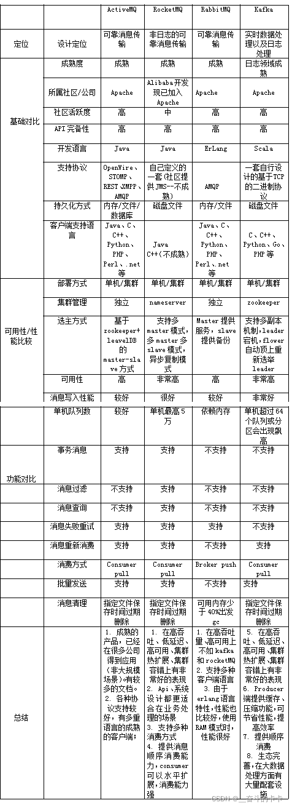

## 1.6 RabbitMQ介绍
RabbitMQ是由erlang语言开发，基于AMQP（Advanced Message Queue 高级消息队列协议）协议实现的消息队列，它是一种应用程序之间的通信方法，消息队列在分布式系统开发中应用非常广泛。

### 1.6.1 特点
RabbitMQ是使用Erlang语言开发的开源消息队列系统，基于AMQP协议来实现。
AMQP的主要特征是面向消息、队列、路由（包括点对点和发布/订阅）、可靠性、安全。

AMQP协议更多用在企业系统内，对数据一致性、稳定性和可靠性要求很高的场景，对性能和吞吐量的要求还在其次。

RabbitMQ的可靠性是非常好的，数据能够保证百分之百的不丢失。可以使用镜像队列，它的稳定性非常好。所以说在我们互联网的金融行业。对数据的稳定性和可靠性要求都非常高的情况下，我们都会选择RabbitMQ。当然没有kafka性能好，但是要比AvtiveMQ性能要好很多。也可以自己做一些性能的优化。

RabbitMQ可以构建异地双活架构，包括每一个节点存储方式可以采用磁盘或者内存的方式。

### 1.6.2 RabbitMQ的集群架构


非常经典的 mirror 镜像模式，保证 100% 数据不丢失。在实际工作中也是用得最多的，并且实现非常的简单，一般互联网大厂都会构建这种镜像集群模式。

mirror 镜像队列，目的是为了保证 rabbitMQ 数据的高可靠性解决方案，主要就是实现数据的同步，一般来讲是2 - 3个节点实现数据同步。对于100%数据可靠性解决方案，一般是采用 3 个节点。

如上图所示，用 KeepAlived 做了 HA-Proxy 的高可用，然后有 3 个节点的 MQ 服务，消息发送到主节点上，主节点通过 mirror 队列把数据同步到其他的MQ节点，这样来实现其高可靠。

这就是RabbitMQ整个镜像模式的集群架构。

RabbitMQ集群架构参考：[RabbitMQ的4种集群架构](https://www.jianshu.com/p/b7cc32b94d2a)


# 2 RabbitMQ的工作原理介绍
首先先介绍一个简单的一个消息推送到接收的流程，提供一个简单的图：
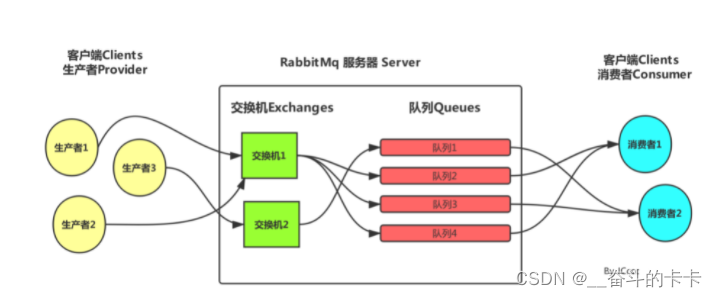

黄色的圈圈就是我们的消息推送服务，将消息推送到 中间方框里面也就是 rabbitMq的服务器，然后经过服务器里面的交换机、队列等各种关系将数据处理入列后，最终右边的蓝色圈圈消费者获取对应监听的消息。

下图是RabbitMQ的基本结构：
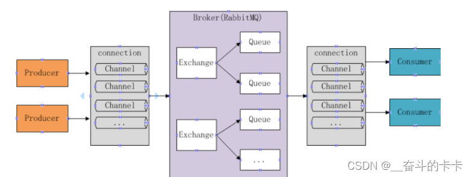

组成部分说明：
- Broker：消息队列服务进程，此进程包括两个部分：Exchange和Queue
- Queue：消息队列，存储消息的队列，消息到达队列并转发给指定的消费者
- Producer：消息生产者，即生产方客户端，生产方客户端将消息发送
- Consumer：消息消费者，即消费方客户端，接收MQ转发的消息。
- Server：接收客户端的连接，实现AMQP实体服务。
- Connection：连接，应用程序与Server的网络连接，TCP连接。
- Channel：信道，消息读写等操作在信道中进行。客户端可以建立多个信道，每个信道代表一个会话任务。
- Message：消息，应用程序和服务器之间传送的数据，消息可以非常简单，也可以很复杂。有Properties和Body组成。Properties为外包装，可以对消息进行修饰，比如消息的优先级、延迟等高级特性；Body就是消息体内容。
- Virtual Host：虚拟主机，用于逻辑隔离。一个虚拟主机里面可以有若干个Exchange和Queue，同一个虚拟主机里面不能有相同名称的Exchange或Queue。
- Exchange：交换器，接收消息，按照路由规则将消息路由到一个或者多个队列，对消息进行过虑。。如果路由不到，或者返回给生产者，或者直接丢弃。RabbitMQ常用的交换器常用类型有direct、topic、fanout
  、headers四种，后面详细介绍。
- Binding：绑定，交换器和消息队列之间的虚拟连接，绑定中可以包含一个或者多个RoutingKey。
- RoutingKey：路由键，生产者将消息发送给交换器的时候，会发送一个RoutingKey，用来指定路由规则，这样交换器就知道把消息发送到哪个队列。路由键通常为一个“.”分割的字符串，例如“com.rabbitmq”。


生产者发送消息流程：
1. 生产者和Broker建立TCP连接。
2. 生产者和Broker建立通道。
3. 生产者通过通道消息发送给Broker，由Exchange将消息进行转发。
4. Exchange将消息转发到指定的Queue（队列）

消费者接收消息流程：
1. 消费者和Broker建立TCP连接
2. 消费者和Broker建立通道
3. 消费者监听指定的Queue（队列）
4. 当有消息到达Queue时Broker默认将消息推送给消费者。
5. 消费者接收到消息。
6. ack回复

整个消息的发布与消费的流程大致如下：
1. 生产者client端指定服务端地址以及vhost虚拟主机，连接服务端
2. 建立连接后，创建Channel信道，设置此信道的属性。
3. 通过信道，声明交换机，队列，绑定关系，以及相关属性
4. 通过信道，发送Message消息到Exchange交换机
5. 交换机通过binding绑定关系与RoutingKey路由键，将消息分发到对应的Queue队列
6. 消费者client通过服务端地址以及vhost连接服务端
7. 建立连接后，创建信道，设置信道属性
8. 通过信道，开启消费者监听队列，从队列中获取消息进行消费
9. 根据是否延迟确认，确认消息已经被正常消费成功后，消息从队列中删除

# 3 RabbitMQ交换机类型
生产者发送消息，并不是直接发送到队列的，而是发送到Exchange交换机，再由交换机分发到相应队列，没有匹配到队列则丢弃消息。根据Exchange的类型不同，可灵活实现常见的消息模式。

## 3.1 Direct exchange（直连交换机）
直连型交换机（direct exchange）是完全匹配型交换机，此种类型交换机，通过RoutingKey路由键将交换机和队列进行绑定， 消息被发送到exchange时，需要根据消息的RoutingKey，来进行匹配，只将消息发送到完全匹配到此RoutingKey的队列。，步骤如下：

1. 将一个队列绑定到某个交换机上，同时赋予该绑定一个路由键（routing key）
2. 当一个携带着路由值为R的消息被发送给直连交换机时，交换机会把它路由给绑定值同样为R的队列。

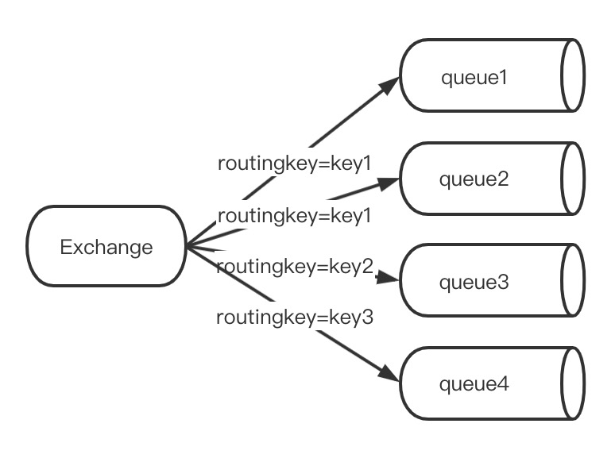

如图，不同的key绑定不同的队列，实现不同消息分发至不同队列。

注意同一个key，可以绑定多个queue队列。如图中，当匹配到key1时，则会将消息分发送至queue1和queue2，这样两个队列都会有相同的消息数据。

## 3.2 Fanout exchange（扇型交换机）
扇型交换机（funout exchange）将消息路由给绑定到它身上的所有队列。不同于直连交换机，路由键在此类型上不启任务作用。如果N个队列绑定到某个扇型交换机上，当有消息发送给此扇型交换机时，交换机会将消息的发送给这所有的N个队列

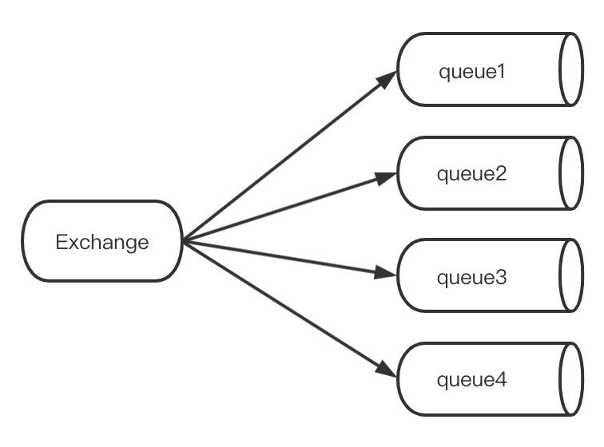

此种方式，最简单快速，性能最好，因为少了中间的匹配判断环节。

## 3.3 Topic exchange（主题交换机）
主题交换机（topic exchange）是模糊匹配型交换机，通过RoutingKey路由键将交换机和队列进行绑定，消息被发送到exchange时，需要根据消息的RoutingKey，来进行匹配，将消息发送到匹配到的队列。

扇型交换机和主题交换机异同：
- 对于扇型交换机路由键是没有意义的，只要有消息，它都发送到它绑定的所有队列上
- 对于主题交换机，路由规则由路由键决定，只有满足路由键的规则，消息才可以路由到对应的队列上

### 3.3.1 binding规则
- `*` (星号) 用来表示一个单词 (必须出现的)
- `#` (井号) 用来表示任意数量（零个或多个）单词

通配的绑定键是跟队列进行绑定的，举个小例子：队列Q1 绑定键为`*.TT.*`,队列Q2绑定键为`TT.#`。 如果一条消息携带的路由键为`A.TT.B`，那么队列Q1将会收到； 如果一条消息携带的路由键为`TT.AA.BB`，那么队列Q2将会收到；

- 当一个队列的绑定键为 `#`（井号） 的时候，这个队列将会无视消息的路由键，接收所有的消息。
- 当`*` (星号) 和`#`(井号) 这两个特殊字符都未在绑定键中出现的时候，此时主题交换机就拥有的直连交换机的行为。
- 所以主题交换机也就实现了扇形交换机的功能，和直连交换机的功能。

### 3.3.2 示意图

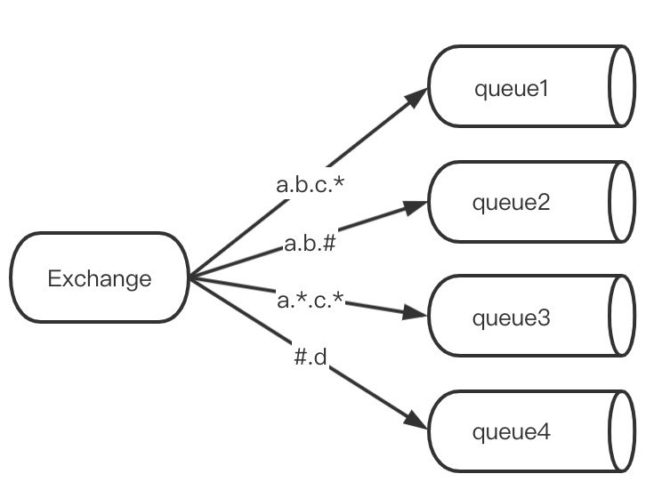

然后发送一条信息，routingkey为`a.b.c.d`，那么根据`.`将这个路由键分为了4个部分，此条路由键，将会匹配：
- `a.b.c.` ：成功匹配，因为可以代表一个部分
- `a.b.#` ：成功匹配，因为#可以代表一个或多个部分
- `a..c..` : 成功匹配，因为第一和第三部分分别为a和c，且为4个部分，刚好匹配
- `#.d` ： 成功匹配，因为最后一个部分为d，前面所有部分被#代表了


## 3.4 Headers exchange（头交换机）
Headers，headers信息类型交换机，此类型交换机不通过routingkey路由键来分发消息，而是通过消息内容中的headers属性来进行匹配。headers类型交换器性能差，在实际中并不常用。

虽然不常用，但也可以了解一下其，此种交换机不通过routingkey，但是通过headers进行绑定，也就是在声明binding绑定关系时，需要传入需要匹配的header的key/value键值对。

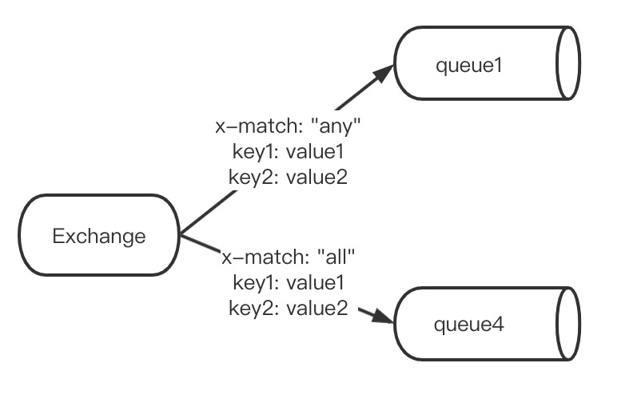

如图，绑定关系中，需要指定"x-match"匹配类型:
- all：需要所有的key-value都匹配，才能匹配成功
- any：只需要其中一个key-value匹配，就匹配成功

## 3.5 RabbitMQ默认交换机
在RabbitMQ默认定义一些交换机，主要如下：

### 3.5.1 默认交换机
默认交换机（default exchange）实际上是一个由RabbitMQ预先声明好的名字为空字符串的直连交换机（direct exchange）。它有一个特殊的属性使得它对于简单应用特别有用处：那就是每个新建队列（queue）都会自动绑定到默认交换机上，绑定的路由键（routing key）名称与队列名称相同。

如：当你声明了一个名为”hello”的队列，RabbitMQ会自动将其绑定到默认交换机上，绑定（binding）的路由键名称也是为”hello”。因此，当携带着名为”hello”的路由键的消息被发送到默认交换机的时候，此消息会被默认交换机路由至名为”hello”的队列中。即默认交换机看起来貌似能够直接将消息投递给队列。

### 3.5.2 类似amq.*的名称的交换机
这些是RabbitMQ默认创建的交换机。这些队列名称被预留做RabbitMQ内部使用，不能被应用使用，否则抛出403 (ACCESS_REFUSED)错误

- amq.direct：直连交换机
- amq.fanout：扇型交换机
- amq.topic：主题交换机
- amq.match：匹配交换机
- amq.headers：头交换机
- amq.rabbitmq.trace：跟踪交换机
- amq.rabbitmq.log：日志交换机
- amq.rabbitmq.trace.direct：跟踪交换机
- amq.rabbitmq.trace.topic：跟踪交换机
- amq.rabbitmq.trace.direct.topic：跟踪交换机

## 3.6 Dead Letter Exchange（死信交换机）
在默认情况，如果消息在投递到交换机时，交换机发现此消息没有匹配的队列，则这个消息将被悄悄丢弃

为了解决这个问题，RabbitMQ中有一种交换机叫死信交换机。当消费者不能处理接收到的消息时，将这个消息重新发布到另外一个队列中，等待重试或者人工干预。这个过程中的exchange和queue就是所谓的”Dead Letter Exchange 和 Queue”


## 3.7 交换机的属性
除交换机类型外，在声明交换机时还可以附带许多其他的属性，其中最重要的几个分别是：
- Name：交换机名称
- Durability：是否持久化。如果持久性，则RabbitMQ重启后，交换机还存在
- Auto-delete：当所有与之绑定的消息队列都完成了对此交换机的使用后，删掉它
- Arguments：扩展参数


# 4 RabbitMQ工作模式

## 4.1 六种工作模式
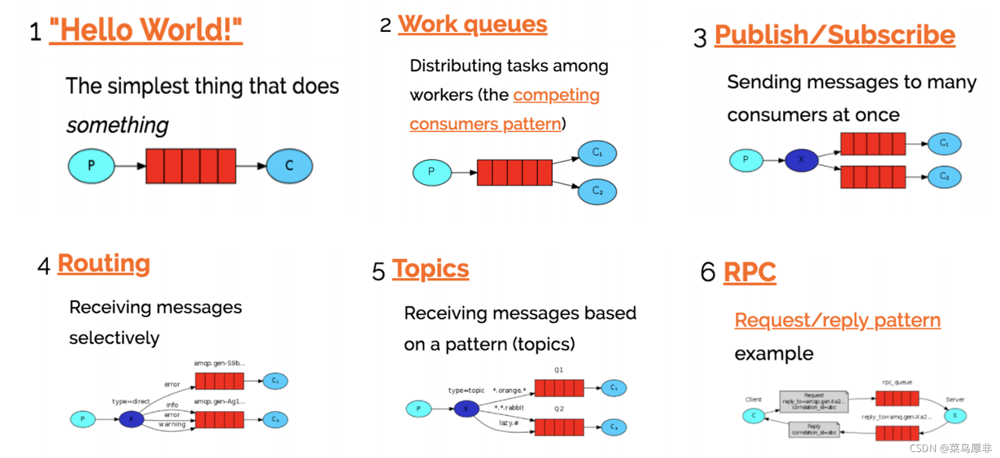

## 4.2 简单模式
这个比较简单，就是一个生产者、一个队列、一个消费者，这种交换机是不参与的。


## 4.2 工作队列
创建一个工作队列（Work Queue），它会发送一些耗时的任务给多个工作者（Worker）。

在多个消息的情况下，Work Queue 会将消息分派给不同的消费者，每个消费者都会接收到不同的消息，并且可以根据处理消息的速度来接收消息的数量，进而让消费者程序发挥最大性能。

Work Queue 特别适合在集群环境中做异步处理，能最大程序发挥每一台服务器的性能。

在高并发情况下，队列里面的消息很容易产生积压，此模式可以扩容消费者进行负载均衡处理消息。

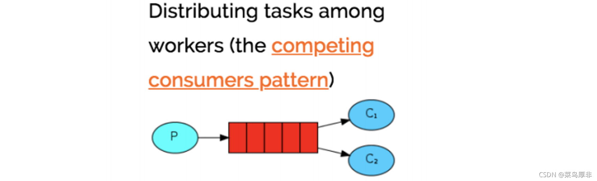

## 4.3 发布订阅
发布订阅是作为生产者产生的一个消息，他的消费者都是可以收到此条消息的。上图，就可以清晰的说明，生产者将消息发给了 broker ，此模式中前面说的交换机，就可以派上用场了。

交换机的作用是将收到的消息，发给多套副本队列，对于的消费者如果订阅了这个队列的话，就可以收到生产者的消息了。

发布/订阅模式中，生产者不再直接与队列绑定，而是将数据发送至“交换机 Exchange ”。

交换机 Exchange 用于将数据按某种规则送入与之绑定的队列，进而供消费者使用。

发布/订阅模式中，交换机将无差别的将所有消息送入与之绑定的队列，所有消费者拿到的消息完全相同。


## 4.4 路由模式
路由（Routing）模式是在发布订阅模式基础上的变种,发布订阅模式是无条件将所有消息分发给所有消费者队列。路由模式则是 Exchange 根据 Routing Key 有条件的将数据筛选后发给消费者队列。

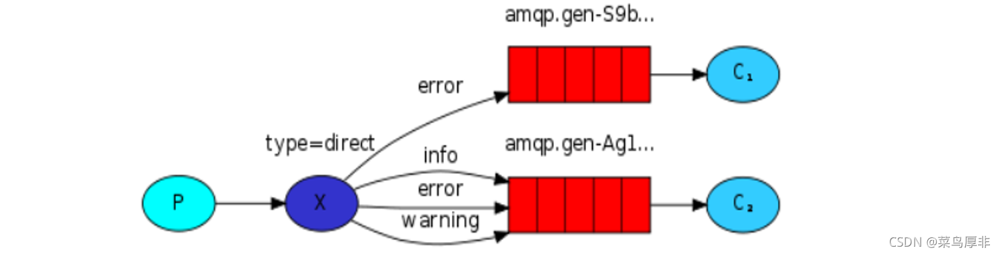

就用上图不同级别日志来说，对于 error 级别的日志信息可能是我们需要特别关注的，会被单单独的消费者进行处理，此时交换机分发消息是有条件的进行分发，这个就是根据 Routing Key 进行不同的消息分发。

路由模式是一种精准的匹配，只有设置了 Routing Key 消息才能进行分发。可以，在实际的工作中还有一些非常模糊的情况，也就是路由模式的升级版，主题模式。

## 4.5 主题模式
主题模式是在原有的 Routing Key 增加了通配符，可以进行 Routing Key 的模糊匹配，进行更加灵活的消息分发。

`*`和`#`，分表是主题模式的通配符，`*`代表单个关键字，`#`代表多个关键字。

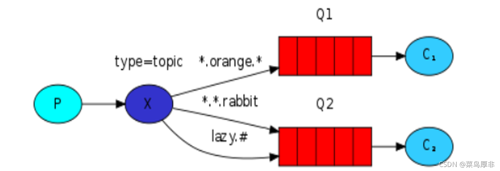

在实际使用场景中， 路由模式的效率是高于主题模式，实际工作中可以使用路由模式解决的问题就尽量不要采用主题模式

## 4.6 RPC同步通信
我们都清楚作为 MQ 本质上都是异步通讯的，作为生产者将消息送达消息队列后呢，作为生产者他的任务就完成了。至于消费者什么时候消费的最终结果呢，生产者是不关心的。

但是很多时间，异步情况并不能满足我们的需求。很多时候生产者产生消息之后，需要得到消费者消费的结果。这种情况下非常像平时的 RPC 远程调用，这种情况下 RabbitMQ 也提供了对应得工作模式。

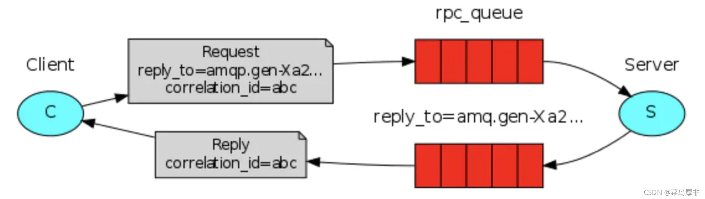

这里实际上有两个队列，作为 clinet 产生了消息后，会将 broker 会将消息放入队列。

接着，会被 server 进行消费，消费后的结果也会放入队列，之后会被 client 进行处理。

而这整个过程，线程会进入阻塞状态，这种模式在实际工作中不怎么用。


# 5 RabbitMQ使用

## 5.1 直连交换机（direct exchange）

### 5.1.1 工作队列模式
直连交换机是一对一，那配置多台监听绑定到同一个直连交互的同一个队列，则是是轮训消费的。

交换机 --> 路由Key --> 队列
TestDirectExchange --> TestDirectRouting --> TestDirectQueue


- 生产者
```java
// 配置类
@EnableRabbit // 配置后无需手动创建交换机、队列、绑定等
@Configuration
public class DirectRabbitConfig {
    //队列 起名：TestDirectQueue
    @Bean
    public Queue TestDirectQueue() {
        // durable:是否持久化,默认是false,持久化队列：会被存储在磁盘上，当消息代理重启时仍然存在，暂存队列：当前连接有效
        // exclusive:默认也是false，只能被当前创建的连接使用，而且当连接关闭后队列即被删除。此参考优先级高于durable
        // autoDelete:是否自动删除，当没有生产者或者消费者使用此队列，该队列会自动删除。
        // return new Queue("TestDirectQueue",true,true,false);

        //一般设置一下队列的持久化就好,其余两个就是默认false
        return new Queue("TestDirectQueue",true);
    }

    //Direct交换机 起名：TestDirectExchange
    @Bean
    DirectExchange TestDirectExchange() {
        //  return new DirectExchange("TestDirectExchange",true,true);
        return new DirectExchange("TestDirectExchange",true,false);
    }

    //绑定
    //将队列和交换机绑定, 并设置用于匹配键：TestDirectRouting
    @Bean
    Binding bindingDirect() {
        return BindingBuilder.bind(TestDirectQueue()).to(TestDirectExchange()).with("TestDirectRouting");
    }
}

// 消息发送者
@GetMapping("/sendDirectMessage")
public String sendDirectMessage() {
  String messageId = String.valueOf(UUID.randomUUID());
  String messageData = "test message, hello!";
  String createTime = LocalDateTime.now().format(DateTimeFormatter.ofPattern("yyyy-MM-dd HH:mm:ss"));
  Map<String,Object> map=new HashMap<>();
  map.put("messageId",messageId);
  map.put("messageData",messageData);
  map.put("createTime",createTime);
  //将消息携带绑定键值：TestDirectRouting 发送到交换机TestDirectExchange
  //此时路由值不能为空
  log.info("sendDirectMessage {} sendMessage：{}",portConfig.getPort(),map);
  rabbitTemplate.convertAndSend("TestDirectExchange", "TestDirectRouting", map);
  return "ok";
}
```

>2024-04-19 21:52:13.049  INFO 1626 --- [nio-8021-exec-1] c.e.r.p.c.SendMessageController          : sendDirectMessage 8021 sendMessage：{createTime=2024-04-19 21:52:13, messageId=a1d64493-01c8-40e8-a864-ecb1bfc90e9e, messageData=test message, hello!}
2024-04-19 21:52:13.054  INFO 1626 --- [nio-8021-exec-1] o.s.a.r.c.CachingConnectionFactory       : Attempting to connect to: [42.193.39.59:5672]
2024-04-19 21:52:13.113  INFO 1626 --- [nio-8021-exec-1] o.s.a.r.c.CachingConnectionFactory       : Created new connection: rabbitConnectionFactory#1e7f2e0f:0/SimpleConnection@64cfa34d [delegate=amqp://guest@42.193.39.59:5672/, localPort= 52519]
2024-04-19 21:52:29.178  INFO 1626 --- [nio-8021-exec-2] c.e.r.p.c.SendMessageController          : sendDirectMessage 8021 sendMessage：{createTime=2024-04-19 21:52:29, messageId=76b2a897-23a2-487b-995f-626838d87c46, messageData=test message, hello!}

- 消费者1
```java
@Component
//监听的队列名称 TestDirectQueue
@RabbitListener(queues = "TestDirectQueue")
@Slf4j
public class DirectReceiver {

    @Autowired
    private PortConfig portConfig;

    @RabbitHandler
    public void process(Map testMessage) {
        log.info("DirectReceiver-{}-消费者收到消息:{}" ,portConfig.getPort(),testMessage.toString());
    }
}
```

>2024-04-19 21:52:13.157  INFO 1194 --- [ntContainer#0-1] c.e.r.custom.listener.DirectReceiver     : DirectReceiver-8022-消费者收到消息:{createTime=2024-04-19 21:52:13, messageId=a1d64493-01c8-40e8-a864-ecb1bfc90e9e, messageData=test message, hello!}

- 消费者2，代码同消费者1，不另做说明

>2024-04-19 21:52:29.196  INFO 1212 --- [ntContainer#0-1] c.e.r.custom.listener.DirectReceiver     : DirectReceiver-8023-消费者收到消息:{createTime=2024-04-19 21:52:29, messageId=76b2a897-23a2-487b-995f-626838d87c46, messageData=test message, hello!}

### 5.1.2 发布订阅模式
通过direct交换机实现广播，则是消费者自动创建队列并绑定到direct交换机上。

交换机 --> 路由Key --> 队列
broadcastDirectExchange --> log.info --> 消费者1自动创建的队列 spring-XXXXX
                                     --> 消费者2自动创建的队列 spring-XXXXX

消费者启动后，自动绑定，消费者停止后，队列自动删除。


- 生产者
```java
// 配置类新增广播交换机，配置绑定
@Bean
DirectExchange broadcastDirectExchange() {
  return new DirectExchange("broadcastDirectExchange");
}

// 广播发送者
@GetMapping("/sendDirectMessage1")
public String sendDirectMessage1() {
  String messageId = String.valueOf(UUID.randomUUID());
  String messageData = "test message broadcast, hello!";
  String createTime = LocalDateTime.now().format(DateTimeFormatter.ofPattern("yyyy-MM-dd HH:mm:ss"));
  Map<String,Object> map=new HashMap<>();
  map.put("messageId",messageId);
  map.put("messageData",messageData);
  map.put("createTime",createTime);
  log.info("sendDirectMessage1 {} sendMessage：{}",portConfig.getPort(),map);
  rabbitTemplate.convertAndSend("broadcastDirectExchange", "log.info", map);
  return "ok";
}
```
>2024-04-20 12:38:05.258  INFO 10533 --- [nio-8021-exec-3] c.e.r.p.c.SendMessageController          : sendDirectMessage1 8021 sendMessage：{createTime=2024-04-20 12:38:05, messageId=25513e7f-a644-46b9-a095-d3310063aeb0, messageData=test message broadcast, hello!}
2024-04-20 12:38:05.274  INFO 10533 --- [nio-8021-exec-3] o.s.a.r.c.CachingConnectionFactory       : Attempting to connect to: [42.193.39.59:5672]
2024-04-20 12:38:05.401  INFO 10533 --- [nio-8021-exec-3] o.s.a.r.c.CachingConnectionFactory       : Created new connection: rabbitConnectionFactory#e044b4a:0/SimpleConnection@1ae4ba43 [delegate=amqp://guest@42.193.39.59:5672/, localPort= 60117]

- 消费者1
```java
// 广播监听
@Component
@RabbitListener(bindings = @QueueBinding(
        value = @Queue, // 不指定队列名称，使用默认临时队列
        exchange = @Exchange(value = "broadcastDirectExchange"),
        key = "log.info"
))
@Slf4j
public class DirectBroadcastReceiver {
    @Autowired
    private PortConfig portConfig;

    @RabbitHandler
    public void process(Map testMessage) {
        log.info("DirectBroadcastReceiver-{}-消费者收到消息:{}" ,portConfig.getPort(),testMessage.toString());
    }
}
```

>2024-04-20 12:38:05.581  INFO 10556 --- [ntContainer#0-1] c.e.r.c.l.DirectBroadcastReceiver        : DirectBroadcastReceiver-8022-消费者收到消息:{createTime=2024-04-20 12:38:05, messageId=25513e7f-a644-46b9-a095-d3310063aeb0, messageData=test message broadcast, hello!}

- 消费者2，代码同消费者1，不另做说明
>2024-04-20 12:38:05.565  INFO 10547 --- [ntContainer#0-1] c.e.r.c.l.DirectBroadcastReceiver        : DirectBroadcastReceiver-8023-消费者收到消息:{createTime=2024-04-20 12:38:05, messageId=25513e7f-a644-46b9-a095-d3310063aeb0, messageData=test message broadcast, hello!}


## 5.2 主题交换机（topic exchange）

### 5.2.1 工作队列模式
topic交换机是一对多的，可以根据Routing Key的模糊匹配，将消息分发到多个队列。当同一个Routing Key有多个消费者(同一个队列，即分布式应用)绑定时，则是轮训消费的。匹配规则是：

交换机 --> 路由Key --> 队列
topicExchange --> topic.man --> topic.man
              --> topic.#   --> topic.woman  (因为通过#匹配，所以topic.man和topic.woman得路由Key都可以匹配)

`TopicManReceiver`监听队列`topic.man`，绑定键为：`topic.man`
`TopicTotalReceiver`监听队列`topic.woman`，绑定键为：`topic.#`

- 生产者
```java
// topic配置类
@Configuration
public class TopicRabbitConfig {
    //绑定键
    public final static String man = "topic.man";
    public final static String woman = "topic.woman";

    @Bean
    public Queue firstQueue() {
        return new Queue(TopicRabbitConfig.man);
    }

    @Bean
    public Queue secondQueue() {
        return new Queue(TopicRabbitConfig.woman);
    }

    @Bean
    TopicExchange exchange() {
        return new TopicExchange("topicExchange");
    }

    //将firstQueue和topicExchange绑定,而且绑定的键值为topic.man
    //这样只要是消息携带的路由键是topic.man,才会分发到该队列
    @Bean
    Binding bindingExchangeMessage() {
        return BindingBuilder.bind(firstQueue()).to(exchange()).with(man);
    }

    //将secondQueue和topicExchange绑定,而且绑定的键值为用上通配路由键规则topic.#
    // 这样只要是消息携带的路由键是以topic.开头,都会分发到该队列
    @Bean
    Binding bindingExchangeMessage2() {
        return BindingBuilder.bind(secondQueue()).to(exchange()).with("topic.#");
    }
}

// 发送topic.man消息
@GetMapping("/sendTopicMessage1")
public String sendTopicMessage1() {
  String messageId = String.valueOf(UUID.randomUUID());
  String messageData = "message: M A N ";
  String createTime = LocalDateTime.now().format(DateTimeFormatter.ofPattern("yyyy-MM-dd HH:mm:ss"));
  Map<String, Object> manMap = new HashMap<>();
  manMap.put("messageId", messageId);
  manMap.put("messageData", messageData);
  manMap.put("createTime", createTime);
  log.info("sendTopicMessage1 {} sendMessage：{}",portConfig.getPort(),manMap);
  rabbitTemplate.convertAndSend("topicExchange", "topic.man", manMap);
  return "ok";
}

// 发送topic.woman消息
@GetMapping("/sendTopicMessage2")
public String sendTopicMessage2() {
  String messageId = String.valueOf(UUID.randomUUID());
  String messageData = "message: woman is all ";
  String createTime = LocalDateTime.now().format(DateTimeFormatter.ofPattern("yyyy-MM-dd HH:mm:ss"));
  Map<String, Object> womanMap = new HashMap<>();
  womanMap.put("messageId", messageId);
  womanMap.put("messageData", messageData);
  womanMap.put("createTime", createTime);
  log.info("sendTopicMessage2 {} sendMessage：{}",portConfig.getPort(),womanMap);
  rabbitTemplate.convertAndSend("topicExchange", "topic.woman", womanMap);
  return "ok";
}
```

>2024-04-20 11:10:35.441  INFO 7946 --- [nio-8021-exec-5] c.e.r.p.c.SendMessageController          : sendTopicMessage1 8021 sendMessage：{createTime=2024-04-20 11:10:35, messageId=3eaad5ea-12f2-4419-8297-5883d83fd046, messageData=message: M A N }
2024-04-20 11:11:05.220  INFO 7946 --- [nio-8021-exec-6] c.e.r.p.c.SendMessageController          : sendTopicMessage1 8021 sendMessage：{createTime=2024-04-20 11:11:05, messageId=874a93ec-a395-4f98-aadc-06a6b7f8a68f, messageData=message: M A N }
2024-04-20 11:11:13.768  INFO 7946 --- [nio-8021-exec-7] c.e.r.p.c.SendMessageController          : sendTopicMessage1 8021 sendMessage：{createTime=2024-04-20 11:11:13, messageId=27c0ab12-85e1-4f7f-92dc-0898c0daf314, messageData=message: M A N }
2024-04-20 11:11:20.551  INFO 7946 --- [nio-8021-exec-8] c.e.r.p.c.SendMessageController          : sendTopicMessage1 8021 sendMessage：{createTime=2024-04-20 11:11:20, messageId=3acbf3f7-fc77-4d10-a871-563c754285b7, messageData=message: M A N }

- 消费者1
```java
// 监听topic.man队列
@Component
@RabbitListener(queues = "topic.man")
@Slf4j
public class TopicManReceiver {

  @Autowired
  private PortConfig portConfig;
  @RabbitHandler
  public void process(Map testMessage) {
    log.info("TopicManReceiver-{}-消费者收到消息:{}" ,portConfig.getPort(),testMessage.toString());
  }
}

// 监听topic.woman队列
@Component
@RabbitListener(queues = "topic.woman")
@Slf4j
public class TopicTotalReceiver {
  @Autowired
  private PortConfig portConfig;
  @RabbitHandler
  public void process(Map testMessage) {
    log.info("TopicTotalReceiver-{}-消费者收到消息:{}" ,portConfig.getPort(),testMessage.toString());
  }
}
```

>2024-04-20 11:10:35.458  INFO 8047 --- [ntContainer#1-1] c.e.r.custom.listener.TopicManReceiver   : TopicManReceiver-8022-消费者收到消息:{createTime=2024-04-20 11:10:35, messageId=3eaad5ea-12f2-4419-8297-5883d83fd046, messageData=message: M A N }
2024-04-20 11:10:35.458  INFO 8047 --- [ntContainer#2-1] c.e.r.c.listener.TopicTotalReceiver      : TopicTotalReceiver-8022-消费者收到消息:{createTime=2024-04-20 11:10:35, messageId=3eaad5ea-12f2-4419-8297-5883d83fd046, messageData=message: M A N }
2024-04-20 11:11:13.781  INFO 8047 --- [ntContainer#2-1] c.e.r.c.listener.TopicTotalReceiver      : TopicTotalReceiver-8022-消费者收到消息:{createTime=2024-04-20 11:11:13, messageId=27c0ab12-85e1-4f7f-92dc-0898c0daf314, messageData=message: M A N }
2024-04-20 11:11:13.782  INFO 8047 --- [ntContainer#1-1] c.e.r.custom.listener.TopicManReceiver   : TopicManReceiver-8022-消费者收到消息:{createTime=2024-04-20 11:11:13, messageId=27c0ab12-85e1-4f7f-92dc-0898c0daf314, messageData=message: M A N }


- 消费者2，代码同消费者1，不另做说明

>2024-04-20 11:11:05.286  INFO 8150 --- [ntContainer#2-1] c.e.r.c.listener.TopicTotalReceiver      : TopicTotalReceiver-8023-消费者收到消息:{createTime=2024-04-20 11:11:05, messageId=874a93ec-a395-4f98-aadc-06a6b7f8a68f, messageData=message: M A N }
2024-04-20 11:11:05.286  INFO 8150 --- [ntContainer#1-1] c.e.r.custom.listener.TopicManReceiver   : TopicManReceiver-8023-消费者收到消息:{createTime=2024-04-20 11:11:05, messageId=874a93ec-a395-4f98-aadc-06a6b7f8a68f, messageData=message: M A N }
2024-04-20 11:11:20.572  INFO 8150 --- [ntContainer#2-1] c.e.r.c.listener.TopicTotalReceiver      : TopicTotalReceiver-8023-消费者收到消息:{createTime=2024-04-20 11:11:20, messageId=3acbf3f7-fc77-4d10-a871-563c754285b7, messageData=message: M A N }
2024-04-20 11:11:20.572  INFO 8150 --- [ntContainer#1-1] c.e.r.custom.listener.TopicManReceiver   : TopicManReceiver-8023-消费者收到消息:{createTime=2024-04-20 11:11:20, messageId=3acbf3f7-fc77-4d10-a871-563c754285b7, messageData=message: M A N }


此处注意几点：
1. 首先两个消费者，都监听了`topic.man`和`topic.woman`队列，所以会收到消息。
2. 其次两个消费者，接收消息是轮流进行的。
3. 另外，`TopicManReceiver`会接受到路由键是`topic.man`的消息。而`TopicTotalReceiver`会接受到路由键是`topic.woman`和`topic.man`的消息。


### 5.2.2 发布订阅模式
topic交换机通过自动配置队列绑定，从而实现广播。并且这些广播可以通过路由键进行过滤。

交换机 --> 路由Key --> 队列
broadcastTopicExchange --> log.error --> 消费者1，只消费error日志，自动创建队列，spring-XXXXX
                       --> log.#     --> 消费者2，只消费error日志和info日志，自动创建队列，spring-XXXXX

- 生产者
```java
// 配置类新增
@Bean
TopicExchange broadcastTopicExchange() {
    return new TopicExchange("broadcastTopicExchange");
}

// 发送error消息
@GetMapping("/sendTopicBroadcastMessage1")
public String sendTopicBroadcastMessage1() {
    String messageId = String.valueOf(UUID.randomUUID());
    String messageData = "message: log.error ";
    String createTime = LocalDateTime.now().format(DateTimeFormatter.ofPattern("yyyy-MM-dd HH:mm:ss"));
    Map<String, Object> manMap = new HashMap<>();
    manMap.put("messageId", messageId);
    manMap.put("messageData", messageData);
    manMap.put("createTime", createTime);
    log.info("sendTopicBroadcastMessage1 {} sendMessage：{}",portConfig.getPort(),manMap);
    rabbitTemplate.convertAndSend("broadcastTopicExchange", "log.error", manMap);
    return "ok";
}

// 发送info消息
@GetMapping("/sendTopicBroadcastMessage2")
public String sendTopicBroadcastMessage2() {
    String messageId = String.valueOf(UUID.randomUUID());
    String messageData = "message: log.info ";
    String createTime = LocalDateTime.now().format(DateTimeFormatter.ofPattern("yyyy-MM-dd HH:mm:ss"));
    Map<String, Object> manMap = new HashMap<>();
    manMap.put("messageId", messageId);
    manMap.put("messageData", messageData);
    manMap.put("createTime", createTime);
    log.info("sendTopicBroadcastMessage2 {} sendMessage：{}",portConfig.getPort(),manMap);
    rabbitTemplate.convertAndSend("broadcastTopicExchange", "log.info", manMap);
    return "ok";
}
```
>2024-04-20 16:55:15.189  INFO 14183 --- [nio-8021-exec-1] o.a.c.c.C.[Tomcat].[localhost].[/]       : Initializing Spring DispatcherServlet 'dispatcherServlet'
2024-04-20 16:55:15.190  INFO 14183 --- [nio-8021-exec-1] o.s.web.servlet.DispatcherServlet        : Initializing Servlet 'dispatcherServlet'
2024-04-20 16:55:15.202  INFO 14183 --- [nio-8021-exec-1] o.s.web.servlet.DispatcherServlet        : Completed initialization in 12 ms
2024-04-20 16:55:15.220  INFO 14183 --- [nio-8021-exec-1] c.e.r.p.c.SendMessageController          : sendTopicBroadcastMessage1 8021 sendMessage：{createTime=2024-04-20 16:55:15, messageId=fe65e242-5736-4243-8e68-fdf3dc080f4d, messageData=message: log.error }
2024-04-20 16:55:15.224  INFO 14183 --- [nio-8021-exec-1] o.s.a.r.c.CachingConnectionFactory       : Attempting to connect to: [42.193.39.59:5672]
2024-04-20 16:55:15.282  INFO 14183 --- [nio-8021-exec-1] o.s.a.r.c.CachingConnectionFactory       : Created new connection: rabbitConnectionFactory#3956b302:0/SimpleConnection@4c05e614 [delegate=amqp://guest@42.193.39.59:5672/, localPort= 65268]
2024-04-20 16:56:17.309  INFO 14183 --- [nio-8021-exec-3] c.e.r.p.c.SendMessageController          : sendTopicBroadcastMessage2 8021 sendMessage：{createTime=2024-04-20 16:56:17, messageId=46e976b6-312e-44ea-b112-694669cf318f, messageData=message: log.info }


- 消费者1
```java
/**
 * 接收error消息
 */
@Component
@RabbitListener(bindings = @QueueBinding(
        value = @Queue, // 不指定队列名称，使用默认临时队列
        exchange = @Exchange(value = "broadcastTopicExchange",type="topic"),
        key = "log.error"
))
@Slf4j
public class TopicErrorBroadcastReceiver {
    @Autowired
    private PortConfig portConfig;
    @RabbitHandler
    public void process(Map testMessage) {
        log.info("TopicErrorBroadcastReceiver-{}-消费者收到消息:{}" ,portConfig.getPort(),testMessage.toString());
    }
}


/**
 * 接收info和error消息
 */
@Component
@RabbitListener(bindings = @QueueBinding(
        value = @Queue, // 不指定队列名称，使用默认临时队列
        exchange = @Exchange(value = "broadcastTopicExchange",type="topic"),
        key = "log.#"
))
@Slf4j
public class TopicInfoBroadcastReceiver {

    @Autowired
    private PortConfig portConfig;
    @RabbitHandler
    public void process(Map testMessage) {
        log.info("TopicInfoBroadcastReceiver-{}-消费者收到消息:{}" ,portConfig.getPort(),testMessage.toString());
    }
}
```

>2024-04-20 16:55:15.587  INFO 14207 --- [ntContainer#3-1] c.e.r.c.l.TopicInfoBroadcastReceiver     : TopicInfoBroadcastReceiver-8022-消费者收到消息:{createTime=2024-04-20 16:55:15, messageId=fe65e242-5736-4243-8e68-fdf3dc080f4d, messageData=message: log.error }
2024-04-20 16:55:15.587  INFO 14207 --- [ntContainer#2-1] c.e.r.c.l.TopicErrorBroadcastReceiver    : TopicErrorBroadcastReceiver-8022-消费者收到消息:{createTime=2024-04-20 16:55:15, messageId=fe65e242-5736-4243-8e68-fdf3dc080f4d, messageData=message: log.error }
2024-04-20 16:56:17.330  INFO 14207 --- [ntContainer#3-1] c.e.r.c.l.TopicInfoBroadcastReceiver     : TopicInfoBroadcastReceiver-8022-消费者收到消息:{createTime=2024-04-20 16:56:17, messageId=46e976b6-312e-44ea-b112-694669cf318f, messageData=message: log.info }


- 消费者2，代码同消费者1，同时接收到消息。

>2024-04-20 16:55:15.578  INFO 14197 --- [ntContainer#2-1] c.e.r.c.l.TopicErrorBroadcastReceiver    : TopicErrorBroadcastReceiver-8023-消费者收到消息:{createTime=2024-04-20 16:55:15, messageId=fe65e242-5736-4243-8e68-fdf3dc080f4d, messageData=message: log.error }
2024-04-20 16:55:15.578  INFO 14197 --- [ntContainer#3-1] c.e.r.c.l.TopicInfoBroadcastReceiver     : TopicInfoBroadcastReceiver-8023-消费者收到消息:{createTime=2024-04-20 16:55:15, messageId=fe65e242-5736-4243-8e68-fdf3dc080f4d, messageData=message: log.error }
2024-04-20 16:56:17.331  INFO 14197 --- [ntContainer#3-1] c.e.r.c.l.TopicInfoBroadcastReceiver     : TopicInfoBroadcastReceiver-8023-消费者收到消息:{createTime=2024-04-20 16:56:17, messageId=46e976b6-312e-44ea-b112-694669cf318f, messageData=message: log.info }


## 5.3 扇型交换机（Fanout Exchange）

### 5.3.1 工作队列模式
扇形交换机默认的工作模式也是工作队列模型。只是没有路由键，每个消费者中绑定到此交换机的队列都会收到消息。对于多个消费者，消息会轮训分配到每个消费者中。

交换机 --> 路由Key --> 队列
fanoutExchange --> null  --> fanout.A   
                         --> fanout.B

- 生产者
```java
// 配置类
@EnableRabbit
@Configuration
public class FanoutRabbitConfig {

    /**
     *  创建三个队列 ：fanout.A   fanout.B
     *  将三个队列都绑定在交换机 fanoutExchange 上
     *  因为是扇型交换机, 路由键无需配置,配置也不起作用
     */

    @Bean
    public Queue queueA() {
        return new Queue("fanout.A");
    }

    @Bean
    public Queue queueB() {
        return new Queue("fanout.B");
    }


    @Bean
    FanoutExchange fanoutExchange() {
        return new FanoutExchange("fanoutExchange");
    }

    @Bean
    Binding bindingExchangeA() {
        return BindingBuilder.bind(queueA()).to(fanoutExchange());
    }

    @Bean
    Binding bindingExchangeB() {
        return BindingBuilder.bind(queueB()).to(fanoutExchange());
    }
}

// 消息生产者
@GetMapping("/sendFanoutMessage")
public String sendFanoutMessage() {
    String messageId = String.valueOf(UUID.randomUUID());
    String messageData = "message: testFanoutMessage ";
    String createTime = LocalDateTime.now().format(DateTimeFormatter.ofPattern("yyyy-MM-dd HH:mm:ss"));
    Map<String, Object> map = new HashMap<>();
    map.put("messageId", messageId);
    map.put("messageData", messageData);
    map.put("createTime", createTime);
    log.info("sendFanoutMessage {} sendMessage：{}",portConfig.getPort(),map);
    rabbitTemplate.convertAndSend("fanoutExchange", null, map);
    return "ok";
}
```

>2024-04-20 20:50:56.971  INFO 17824 --- [nio-8021-exec-1] o.a.c.c.C.[Tomcat].[localhost].[/]       : Initializing Spring DispatcherServlet 'dispatcherServlet'
2024-04-20 20:50:56.972  INFO 17824 --- [nio-8021-exec-1] o.s.web.servlet.DispatcherServlet        : Initializing Servlet 'dispatcherServlet'
2024-04-20 20:50:56.982  INFO 17824 --- [nio-8021-exec-1] o.s.web.servlet.DispatcherServlet        : Completed initialization in 10 ms
2024-04-20 20:50:57.007  INFO 17824 --- [nio-8021-exec-1] c.e.r.p.c.SendMessageController          : sendFanoutMessage 8021 sendMessage：{createTime=2024-04-20 20:50:57, messageId=0ae72439-39a5-419c-a99d-8a9ec73a0690, messageData=message: testFanoutMessage }
2024-04-20 20:50:57.012  INFO 17824 --- [nio-8021-exec-1] o.s.a.r.c.CachingConnectionFactory       : Attempting to connect to: [42.193.39.59:5672]
2024-04-20 20:50:57.078  INFO 17824 --- [nio-8021-exec-1] o.s.a.r.c.CachingConnectionFactory       : Created new connection: rabbitConnectionFactory#46044faa:0/SimpleConnection@11d0522f [delegate=amqp://guest@42.193.39.59:5672/, localPort= 51590]
2024-04-20 20:52:37.118  INFO 17824 --- [nio-8021-exec-3] c.e.r.p.c.SendMessageController          : sendFanoutMessage 8021 sendMessage：{createTime=2024-04-20 20:52:37, messageId=e843d52c-cd65-46f6-8083-3f93304acf98, messageData=message: testFanoutMessage }

- 消费者1，该消费者中的A，B队列都会收到消息。
```java
// 队列A监听
@Component
@RabbitListener(queues = "fanout.A")
@Slf4j
public class FanoutReceiverA {

    @Autowired
    private PortConfig portConfig;

    @RabbitHandler
    public void process(Map testMessage) {
        log.info("FanoutReceiverA-{}-消费者收到消息:{}" ,portConfig.getPort(),testMessage.toString());
    }
}

// 队列B监听
@Component
@RabbitListener(queues = "fanout.B")
@Slf4j
public class FanoutReceiverB {

    @Autowired
    private PortConfig portConfig;

    @RabbitHandler
    public void process(Map testMessage) {
        log.info("FanoutReceiverB-{}-消费者收到消息:{}" ,portConfig.getPort(),testMessage.toString());
    }
}
```

>2024-04-20 20:52:37.173  INFO 17838 --- [ntContainer#3-1] c.e.r.custom.listener.FanoutReceiverB    : FanoutReceiverB-8022-消费者收到消息:{createTime=2024-04-20 20:52:37, messageId=e843d52c-cd65-46f6-8083-3f93304acf98, messageData=message: testFanoutMessage }
2024-04-20 20:52:37.173  INFO 17838 --- [ntContainer#2-1] c.e.r.custom.listener.FanoutReceiverA    : FanoutReceiverA-8022-消费者收到消息:{createTime=2024-04-20 20:52:37, messageId=e843d52c-cd65-46f6-8083-3f93304acf98, messageData=message: testFanoutMessage }

- 消费者2，代码同消费者1，不做说明。

>2024-04-20 20:50:57.283  INFO 17833 --- [ntContainer#2-1] c.e.r.custom.listener.FanoutReceiverA    : FanoutReceiverA-8023-消费者收到消息:{createTime=2024-04-20 20:50:57, messageId=0ae72439-39a5-419c-a99d-8a9ec73a0690, messageData=message: testFanoutMessage }
2024-04-20 20:50:57.283  INFO 17833 --- [ntContainer#3-1] c.e.r.custom.listener.FanoutReceiverB    : FanoutReceiverB-8023-消费者收到消息:{createTime=2024-04-20 20:50:57, messageId=0ae72439-39a5-419c-a99d-8a9ec73a0690, messageData=message: testFanoutMessage }


### 5.3.2 发布订阅模式
实现发布订阅模式，针对多个消费者而言，每个消费者中的队列都必须是不同的。即消费者1是，fanout.A，消费者2是，fanout.A1。这样才能保证同时监听到消息。

交换机 --> 路由Key --> 队列
broadcastFanoutExchange --> null  --> 消费者1  fanout.A.spring.XXXX   
                                  --> 消费者2  fanout.A.spring.XXXX

- 生产者
```java
// 配置类新增
@Bean
FanoutExchange broadcastFanoutExchange() {
    return new FanoutExchange("broadcastFanoutExchange");
}

// 广播消息
@GetMapping("/sendFanoutMessage1")
public String sendFanoutMessage1() {
    String messageId = String.valueOf(UUID.randomUUID());
    String messageData = "message: testBroadCastFanoutMessage ";
    String createTime = LocalDateTime.now().format(DateTimeFormatter.ofPattern("yyyy-MM-dd HH:mm:ss"));
    Map<String, Object> map = new HashMap<>();
    map.put("messageId", messageId);
    map.put("messageData", messageData);
    map.put("createTime", createTime);
    log.info("sendFanoutMessage1 {} sendMessage：{}",portConfig.getPort(),map);
    rabbitTemplate.convertAndSend("broadcastFanoutExchange", null, map);
    return "ok";
}
```
>2024-04-20 21:13:39.444  INFO 18536 --- [nio-8021-exec-1] o.a.c.c.C.[Tomcat].[localhost].[/]       : Initializing Spring DispatcherServlet 'dispatcherServlet'
2024-04-20 21:13:39.444  INFO 18536 --- [nio-8021-exec-1] o.s.web.servlet.DispatcherServlet        : Initializing Servlet 'dispatcherServlet'
2024-04-20 21:13:39.454  INFO 18536 --- [nio-8021-exec-1] o.s.web.servlet.DispatcherServlet        : Completed initialization in 10 ms
2024-04-20 21:13:39.479  INFO 18536 --- [nio-8021-exec-1] c.e.r.p.c.SendMessageController          : sendFanoutMessage1 8021 sendMessage：{createTime=2024-04-20 21:13:39, messageId=2d434e73-ee8a-426b-a317-60c4dba092f5, messageData=message: testBroadCastFanoutMessage }
2024-04-20 21:13:39.484  INFO 18536 --- [nio-8021-exec-1] o.s.a.r.c.CachingConnectionFactory       : Attempting to connect to: [42.193.39.59:5672]
2024-04-20 21:13:39.544  INFO 18536 --- [nio-8021-exec-1] o.s.a.r.c.CachingConnectionFactory       : Created new connection: rabbitConnectionFactory#538cd0f2:0/SimpleConnection@76e37cc5 [delegate=amqp://guest@42.193.39.59:5672/, localPort= 52054]


- 消费者1，这里只使用了`fanout.A.XXXXX`队列测试，未使用`fanout.B.XXXXX`，只要配置上也是可以接受到的

```java
// 临时队列fanout.A.xxxx的监听器
@Component
@RabbitListener(bindings = @QueueBinding(
        // 自定义临时队列名称，使用了SpEL来指定队列名称
        value = @Queue(value = "fanout.A" + "-" + "#{ T(java.util.UUID).randomUUID() }"),
        exchange = @Exchange(value = "broadcastFanoutExchange",type="fanout")
))
@Slf4j
public class FanoutBroadcastReceiver {
    @Autowired
    private PortConfig portConfig;

    @RabbitHandler
    public void process(Map testMessage) {
        log.info("FanoutBroadcastReceiver-{}-消费者收到消息:{}" ,portConfig.getPort(),testMessage.toString());
    }
}
```
>2024-04-20 21:13:39.858  INFO 18523 --- [ntContainer#2-1] c.e.r.c.l.FanoutBroadcastReceiver        : FanoutBroadcastReceiver-8022-消费者收到消息:{createTime=2024-04-20 21:13:39, messageId=2d434e73-ee8a-426b-a317-60c4dba092f5, messageData=message: testBroadCastFanoutMessage }

- 消费者2，代码同消费者1，不做说明。

>2024-04-20 21:13:39.858  INFO 18523 --- [ntContainer#3-1] c.e.r.c.l.FanoutBroadcastReceiver        : FanoutBroadcastReceiver-8023-消费者收到消息:{createTime=2024-04-20 21:13:39, messageId=2d434e73-ee8a-426b-a317-60c4dba092f5, messageData=message: testBroadCastFanoutMessage}

## 5.4 消息回调
消息回调就是消息确认的一种方式，当消息发送到交换机后，交换机会回调生产者的消息，当消息被消费者接收到后，交换机会回调消费者的消息。

### 5.4.1 生产者消息确认回调机制
目的application.yml文件上，加上消息确认的配置项`publisher-confirm-type: correlated`
```bash
server:
  port: 8021
spring:
  #给项目来个名字
  application:
    name: rabbitmq-provider
  #配置rabbitMq 服务器
  rabbitmq:
    host: 42.193.39.59
    port: 5672
    username: guest
    password: guest
    #虚拟host 可以不设置,使用server默认host
    virtual-host:
    #消息确认配置项
    #确认消息已发送到交换机(Exchange)
    publisher-confirm-type: correlated
```

配置相关的消息确认回调函数
```java
import lombok.extern.slf4j.Slf4j;
import org.springframework.amqp.rabbit.connection.ConnectionFactory;
import org.springframework.amqp.rabbit.core.RabbitTemplate;
import org.springframework.context.annotation.Bean;
import org.springframework.context.annotation.Configuration;

@Configuration
@Slf4j
public class RabbitConfig {

    @Bean
    public RabbitTemplate createRabbitTemplate(ConnectionFactory connectionFactory){
        RabbitTemplate rabbitTemplate = new RabbitTemplate();
        rabbitTemplate.setConnectionFactory(connectionFactory);
        //设置开启Mandatory,才能触发回调函数,无论消息推送结果怎么样都强制调用回调函数
        rabbitTemplate.setMandatory(true);

        // 消息确认接口，只要发送到交换机，即为成功。触发时机:
        // 1. 消息推送到server，但是在server里找不到交换机  ack为false
        // 2. 消息推送到server，找到交换机了，但是没找到队列  ack为true
        // 3. 消息推送到sever，交换机和队列啥都没找到   ack为false
        // 4. 消息推送成功   ack为true
        rabbitTemplate.setConfirmCallback((correlationData, ack, cause) -> {
            log.info("ConfirmCallback-相关数据：{}",correlationData);
            log.info("ConfirmCallback-确认情况：{}",ack);
            log.info("ConfirmCallback-原因：{}",cause);
        });

        // 消息返回接口，只要消息推送到交换机，没有投递给消费者，就会触发这个接口。触发时机：
        // 1. 消息推送到server，找到交换机了，但是没找到队列
        rabbitTemplate.setReturnCallback((message, replyCode, replyText, exchange, routingKey) -> {
            log.info("ReturnCallback-消息：{}",message);
            log.info("ReturnCallback-回应码："+replyCode);
            log.info("ReturnCallback-回应信息：{}",replyText);
            log.info("ReturnCallback-交换机：{}",exchange);
            log.info("ReturnCallback-路由键：{}",routingKey);
        });
        return rabbitTemplate;
    }
}
```

### 5.4.2 消费者消息确认机制
在RabbitMQ中，消息确认机制是指消费者告知 RabbitMQ 何时可以安全地从队列中删除已经接收并处理过的消息。这是为了确保消息不会在消费者处理失败或崩溃时丢失。

在RabbitMQ中，消息确认机制有两种方式：

#### 5.4.2.1 自动确认模式（Auto Acknowledgment）
在自动确认模式下，一旦消息被RabbitMQ分发给消费者，它就会立即将消息标记为已确认，并将其从队列中删除。消费者无需做任何额外的确认操作。这种模式下，消费者处理消息后，RabbitMQ 将假定消息已经成功处理，并且不会重复发送消息。但是如果消费者在处理消息时发生了错误，消息将会丢失。

这也是默认的消息确认情况。 `AcknowledgeMode.NONE`

RabbitMQ成功将消息发出（即将消息成功写入TCP Socket）中立即认为本次投递已经被正确处理，不管消费者端是否成功处理本次投递。

所以这种情况如果消费端消费逻辑抛出异常，也就是消费端没有处理成功这条消息，那么就相当于丢失了消息。

一般这种情况我们都是使用`try catch`捕捉异常后，打印日志用于追踪数据，这样找出对应数据再做后续处理。


#### 5.4.2.2 手动确认模式（Manual Acknowledgment）
在手动确认模式下，消费者需要在处理完消息后向 RabbitMQ 明确发送一个确认信号（ACK）。只有在收到确认信号后，RabbitMQ 才会将消息标记为已确认，并从队列中删除。如果消费者处理消息失败，可以选择拒绝消息并将其重新放回队列，或者将其标记为已处理并删除。这样可以确保消息不会丢失，并且可以处理一些异常情况。

这个比较关键，也是我们配置接收消息确认机制时，多数选择的模式。

消费者收到消息后，手动调用`basic.ack`/`basic.nack`/`basic.reject`后，RabbitMQ收到这些消息后，才认为本次投递成功。
- `basic.ack`:用于肯定确认
- `basic.nack`:用于否定确认（注意：这是AMQP 0-9-1的RabbitMQ扩展）
- `basic.reject`:用于否定确认，但与`basic.nack`相比有一个限制：一次只能拒绝单条消息

消费者端以上的3个方法都表示消息已经被正确投递，但是`basic.ack`表示消息已经被正确处理。 而`basic.nack`,`basic.reject`表示没有被正确处理。

- 着重讲下`reject`，因为有时候一些场景是需要重新入列的。

`channel.basicReject(deliveryTag, true);`拒绝消费当前消息，如果第二参数传入true，就是将数据重新丢回队列里，那么下次还会消费这消息。设置false，就是告诉服务器，我已经知道这条消息数据了，因为一些原因拒绝它，而且服务器把这个消息丢掉就行，下次不想再消费这条消息了。

使用拒绝后重新入列这个确认模式要谨慎，因为一般都是出现异常的时候，catch异常再拒绝入列，选择是否重入列。

但是如果使用不当会导致一些每次都被你重入列的消息一直消费-入列-消费-入列这样循环，会导致消息积压。

- 简单讲讲`nack`，这个也是相当于设置不消费某条消息。

`channel.basicNack(deliveryTag, false, true);`第一个参数依然是当前消息到的数据的唯一id；第二个参数是指是否针对多条消息；如果是true，也就是说一次性针对当前通道的消息的tagID小于当前这条消息的，都拒绝确认；第三个参数是指是否重新入列，也就是指不确认的消息是否重新丢回到队列里面去。

同样使用不确认后重新入列这个确认模式要谨慎，因为这里也可能因为考虑不周出现消息一直被重新丢回去的情况，导致积压

#### 5.4.2.3 实现手动确认的方式

1. 监听器容器修改实现

```java
// 在消费者项目里，新建MessageListenerConfig.java上添加代码相关的配置代码
import com.elegant.rabbitmqconsumer.receiver.MyAckReceiver;
import org.springframework.amqp.core.AcknowledgeMode;
import org.springframework.amqp.core.Queue;
import org.springframework.amqp.rabbit.connection.CachingConnectionFactory;
import org.springframework.amqp.rabbit.listener.SimpleMessageListenerContainer;
import org.springframework.beans.factory.annotation.Autowired;
import org.springframework.context.annotation.Bean;
import org.springframework.context.annotation.Configuration;

@Configuration
public class MessageListenerConfig {

    @Autowired
    private CachingConnectionFactory connectionFactory;
    @Autowired
    private MyAckReceiver myAckReceiver;//消息接收处理类

    @Bean
    public SimpleMessageListenerContainer simpleMessageListenerContainer() {
        SimpleMessageListenerContainer container = new SimpleMessageListenerContainer(connectionFactory);
        container.setConcurrentConsumers(1);
        container.setMaxConcurrentConsumers(1);
        // RabbitMQ默认是自动确认，这里改为手动确认消息
        container.setAcknowledgeMode(AcknowledgeMode.MANUAL);
        //设置一个队列
        container.setQueueNames("TestDirectQueue");
        //如果同时设置多个如下： 前提是队列都是必须已经创建存在的
        //  container.setQueueNames("TestDirectQueue","TestDirectQueue2","TestDirectQueue3");

        //另一种设置队列的方法,如果使用这种情况,那么要设置多个,就使用addQueues
        //container.setQueues(new Queue("TestDirectQueue",true));
        //container.addQueues(new Queue("TestDirectQueue2",true));
        //container.addQueues(new Queue("TestDirectQueue3",true));
        container.setMessageListener(myAckReceiver);

        return container;
    }
}

// 对应的手动确认消息监听类，MyAckReceiver.java（手动确认模式需要实现 ChannelAwareMessageListener）
import com.rabbitmq.client.Channel;
import org.springframework.amqp.core.Message;
import org.springframework.amqp.rabbit.listener.api.ChannelAwareMessageListener;
import org.springframework.stereotype.Component;
import java.util.HashMap;
import java.util.Map;

@Component

public class MyAckReceiver implements ChannelAwareMessageListener {

    @Override
    public void onMessage(Message message, Channel channel) throws Exception {
        long deliveryTag = message.getMessageProperties().getDeliveryTag();
        try {
            //因为传递消息的时候用的map传递,所以将Map从Message内取出需要做些处理
            String msg = message.toString();
            String[] msgArray = msg.split("'");//可以点进Message里面看源码,单引号直接的数据就是我们的map消息数据
            Map<String, String> msgMap = mapStringToMap(msgArray[1].trim(),3);
            String messageId=msgMap.get("messageId");
            String messageData=msgMap.get("messageData");
            String createTime=msgMap.get("createTime");
            System.out.println("  MyAckReceiver  messageId:"+messageId+"  messageData:"+messageData+"  createTime:"+createTime);
            System.out.println("消费的主题消息来自："+message.getMessageProperties().getConsumerQueue());
            channel.basicAck(deliveryTag, true); //第二个参数，手动确认可以被批处理，当该参数为 true 时，则可以一次性确认 delivery_tag 小于等于传入值的所有消息
//			channel.basicReject(deliveryTag, true);//第二个参数，true会重新放回队列，所以需要自己根据业务逻辑判断什么时候使用拒绝
        } catch (Exception e) {
            channel.basicReject(deliveryTag, false);
            e.printStackTrace();
        }
    }

    //{key=value,key=value,key=value} 格式转换成map
    private Map<String, String> mapStringToMap(String str,int entryNum ) {
        str = str.substring(1, str.length() - 1);
        String[] strs = str.split(",",entryNum);
        Map<String, String> map = new HashMap<String, String>();
        for (String string : strs) {
            String key = string.split("=")[0].trim();
            String value = string.split("=")[1];
            map.put(key, value);
        }
        return map;
    }
}

// 如何将多个队列监听都改为手动确认模式
// 上述配置类中的代码中，已经有多个队列的监听都改为手动确认模式

// 监听类的修改，只需要根据消息来自的队列名进行区分处理即可
import com.rabbitmq.client.Channel;
import org.springframework.amqp.core.Message;
import org.springframework.amqp.rabbit.listener.api.ChannelAwareMessageListener;
import org.springframework.stereotype.Component;
import java.util.HashMap;
import java.util.Map;

@Component
public class MyAckReceiver implements ChannelAwareMessageListener {

    @Override
    public void onMessage(Message message, Channel channel) throws Exception {
        long deliveryTag = message.getMessageProperties().getDeliveryTag();
        try {
            //因为传递消息的时候用的map传递,所以将Map从Message内取出需要做些处理
            String msg = message.toString();
            String[] msgArray = msg.split("'");//可以点进Message里面看源码,单引号直接的数据就是我们的map消息数据
            Map<String, String> msgMap = mapStringToMap(msgArray[1].trim(),3);
            String messageId=msgMap.get("messageId");
            String messageData=msgMap.get("messageData");
            String createTime=msgMap.get("createTime");

            if ("TestDirectQueue".equals(message.getMessageProperties().getConsumerQueue())){
                System.out.println("消费的消息来自的队列名为："+message.getMessageProperties().getConsumerQueue());
                System.out.println("消息成功消费到  messageId:"+messageId+"  messageData:"+messageData+"  createTime:"+createTime);
                System.out.println("执行TestDirectQueue中的消息的业务处理流程......");
            }

            if ("fanout.A".equals(message.getMessageProperties().getConsumerQueue())){
                System.out.println("消费的消息来自的队列名为："+message.getMessageProperties().getConsumerQueue());
                System.out.println("消息成功消费到  messageId:"+messageId+"  messageData:"+messageData+"  createTime:"+createTime);
                System.out.println("执行fanout.A中的消息的业务处理流程......");

            }

            channel.basicAck(deliveryTag, true);
//			channel.basicReject(deliveryTag, true);//为true会重新放回队列
        } catch (Exception e) {
            channel.basicReject(deliveryTag, false);
            e.printStackTrace();
        }
    }

    //{key=value,key=value,key=value} 格式转换成map
    private Map<String, String> mapStringToMap(String str,int enNum) {
        str = str.substring(1, str.length() - 1);
        String[] strs = str.split(",",enNum);
        Map<String, String> map = new HashMap<String, String>();
        for (String string : strs) {
            String key = string.split("=")[0].trim();
            String value = string.split("=")[1];
            map.put(key, value);
        }
        return map;
    }
}

```

2. 监听类修改实现

此种方法由ChatGPT辅助完成。未经检验

在Spring Boot中，你可以使用`@RabbitListener`注解配合`ChannelAwareMessageListener`接口来实现手动确认模式。

当使用`@RabbitListener`注解配合`ChannelAwareMessageListener`接口来实现手动确认模式时，你需要在`@RabbitListener`注解中指定ackMode为`AcknowledgeMode.MANUAL`，以确保消息的手动确认。

```java
import org.springframework.amqp.core.Message;
import org.springframework.amqp.rabbit.annotation.RabbitListener;
import org.springframework.amqp.support.Acknowledgment;
import org.springframework.stereotype.Component;

@Component
public class RabbitMQConsumer implements ChannelAwareMessageListener {

    @Override
    @RabbitListener(queues = "myQueue", ackMode = "MANUAL")
    public void onMessage(Message message, Channel channel) throws Exception {
        try {
            // 处理消息
            System.out.println("Received message: " + new String(message.getBody()));

            // 手动确认消息
            channel.basicAck(message.getMessageProperties().getDeliveryTag(), false);
        } catch (Exception e) {
            // 处理异常
            // 如果出现异常，你可以选择拒绝消息并重新放回队列，或者将其标记为已处理并删除
            channel.basicReject(message.getMessageProperties().getDeliveryTag(), false);
        }
    }
}
```
在`onMessage`方法中，我们首先处理消息，然后通过`channel.basicAck()`方法来手动确认消息。如果处理消息时发生异常，我们可以选择拒绝消息并将其重新放回队列，或者将其标记为已处理并删除。在本例中，我们使用`channel.basicReject()`方法来拒绝消息。

请注意，你需要注入`Channel`对象，并使用它来发送确认信号或拒绝信号。确保在处理完消息后进行手动确认或拒绝，以确保消息的可靠性和正确性。

3. 连接工厂修改实现

```java
// 在RabbitMQ连接工厂中将确认模式设置为手动确认。确保RabbitTemplate使用手动确认模式。
import org.springframework.amqp.rabbit.connection.ConnectionFactory;
import org.springframework.amqp.rabbit.core.RabbitTemplate;
import org.springframework.context.annotation.Bean;
import org.springframework.context.annotation.Configuration;
import org.springframework.amqp.core.Queue;
import org.springframework.amqp.rabbit.annotation.EnableRabbit;

@Configuration
@EnableRabbit // 开启对 @RabbitListener 注解的支持
public class RabbitMQConfig {

    @Bean
    public ConnectionFactory connectionFactory() {
        // 配置 RabbitMQ 连接工厂
        CachingConnectionFactory connectionFactory = new CachingConnectionFactory();
        connectionFactory.setHost("localhost");
        connectionFactory.setPort(5672);
        connectionFactory.setUsername("guest");
        connectionFactory.setPassword("guest");

        // 设置确认模式为手动确认
        connectionFactory.setPublisherConfirms(true);
        connectionFactory.setPublisherReturns(true);

        return connectionFactory;
    }

    @Bean
    public RabbitTemplate rabbitTemplate(ConnectionFactory connectionFactory) {
        // 创建 RabbitTemplate
        RabbitTemplate rabbitTemplate = new RabbitTemplate(connectionFactory);
        return rabbitTemplate;
    }

    @Bean
    public Queue myQueue() {
        return new Queue("myQueue");
    }
}

// 在监听类中使用RabbitTemplate.basicAck() 方法来手动确认消息
import org.springframework.amqp.core.Message;
import org.springframework.amqp.rabbit.annotation.RabbitListener;
import org.springframework.amqp.rabbit.core.RabbitTemplate;
import org.springframework.beans.factory.annotation.Autowired;
import org.springframework.stereotype.Component;

@Component
public class RabbitMQConsumer {

    @Autowired
    private RabbitTemplate rabbitTemplate;

    @RabbitListener(queues = "myQueue")
    public void handleMessage(Message message) {
        try {
            // 处理消息
            System.out.println("Received message: " + new String(message.getBody()));

            // 手动确认消息
            rabbitTemplate.basicAck(message.getMessageProperties().getDeliveryTag(), false);
        } catch (Exception e) {
            // 处理异常
            // 如果出现异常，你可以选择拒绝消息并重新放回队列，或者将其标记为已处理并删除
            rabbitTemplate.basicReject(message.getMessageProperties().getDeliveryTag(), false);
        }
    }
}
```
## 5.5 死信队列

### 5.5.1 死信队列的定义
死信，在官网中对应的单词为“Dead Letter”，可以看出翻译确实非常的简单粗暴。那么死信是个什么东西呢？

“死信”是RabbitMQ中的一种消息机制，当你在消费消息时，如果队列里的消息出现以下情况：

消息被否定确认，使用 channel.basicNack 或 channel.basicReject ，并且此时requeue 属性被设置为false。
消息在队列的存活时间超过设置的TTL时间。
消息队列的消息数量已经超过最大队列长度。
那么该消息将成为“死信”。

“死信”消息会被RabbitMQ进行特殊处理，如果配置了死信队列信息，那么该消息将会被丢进死信队列中，如果没有配置，则该消息将会被丢弃。

### 5.5.2 死信队列的配置
大概可以分为以下步骤：

配置业务队列，绑定到业务交换机上
为业务队列配置死信交换机和路由key
为死信交换机配置死信队列
注意，并不是直接声明一个公共的死信队列，然后所以死信消息就自己跑到死信队列里去了。而是为每个需要使用死信的业务队列配置一个死信交换机，这里同一个项目的死信交换机可以共用一个，然后为每个业务队列分配一个单独的路由key。

有了死信交换机和路由key后，接下来，就像配置业务队列一样，配置死信队列，然后绑定在死信交换机上。也就是说，死信队列并不是什么特殊的队列，只不过是绑定在死信交换机上的队列。死信交换机也不是什么特殊的交换机，只不过是用来接受死信的交换机，所以可以为任何类型【Direct、Fanout、Topic】。一般来说，会为每个业务队列分配一个独有的路由key，并对应的配置一个死信队列进行监听，也就是说，一般会为每个重要的业务队列配置一个死信队列。

### 5.5.3 示例

业务交换机 -->  业务路由  --> 业务队列   -->  死信交换机  --> 死信路由 -->  死信队列
business.exchange --> null --> business.queuea --> deadletter.exchange --> deadletter.queuea.routingkey --> deadletter.queuea 
                           --> business.queueb                         --> deadletter.queueb.routingkey --> deadletter.queueb

- 生产者

```java
// 配置死信队列
// 声明了两个Exchange，一个是业务Exchange，另一个是死信Exchange，业务Exchange下绑定了两个业务队列，业务队列都配置了同一个死信Exchange，并分别配置了路由key，在死信Exchange下绑定了两个死信队列，设置的路由key分别为业务队列里配置的路由key

@EnableRabbit
@Configuration
public class DeadLetterRabbitConfig {

    public static final String BUSINESS_EXCHANGE_NAME = "dead.letter.demo.simple.business.exchange";
    public static final String BUSINESS_QUEUEA_NAME = "dead.letter.demo.simple.business.queuea";
    public static final String BUSINESS_QUEUEB_NAME = "dead.letter.demo.simple.business.queueb";
    public static final String DEAD_LETTER_EXCHANGE = "dead.letter.demo.simple.deadletter.exchange";
    public static final String DEAD_LETTER_QUEUEA_ROUTING_KEY = "dead.letter.demo.simple.deadletter.queuea.routingkey";
    public static final String DEAD_LETTER_QUEUEB_ROUTING_KEY = "dead.letter.demo.simple.deadletter.queueb.routingkey";
    public static final String DEAD_LETTER_QUEUEA_NAME = "dead.letter.demo.simple.deadletter.queuea";
    public static final String DEAD_LETTER_QUEUEB_NAME = "dead.letter.demo.simple.deadletter.queueb";

    // 声明业务Exchange
    @Bean("businessExchange")
    public FanoutExchange businessExchange(){ return new FanoutExchange(BUSINESS_EXCHANGE_NAME); }

    // 声明死信Exchange
    @Bean("deadLetterExchange")
    public DirectExchange deadLetterExchange(){ return new DirectExchange(DEAD_LETTER_EXCHANGE); }

    // 声明业务队列A
    @Bean("businessQueueA")
    public Queue businessQueueA(){
        Map<String, Object> args = new HashMap<>(2);
        // x-dead-letter-exchange 这里声明当前队列绑定的死信交换机
        args.put("x-dead-letter-exchange", DEAD_LETTER_EXCHANGE);
        // x-dead-letter-routing-key 这里声明当前队列的死信路由key
        args.put("x-dead-letter-routing-key", DEAD_LETTER_QUEUEA_ROUTING_KEY);
        return QueueBuilder.durable(BUSINESS_QUEUEA_NAME).withArguments(args).build();
    }

    // 声明业务队列B
    @Bean("businessQueueB")
    public Queue businessQueueB(){
        Map<String, Object> args = new HashMap<>(2);
        // x-dead-letter-exchange 这里声明当前队列绑定的死信交换机
        args.put("x-dead-letter-exchange", DEAD_LETTER_EXCHANGE);
        // x-dead-letter-routing-key 这里声明当前队列的死信路由key
        args.put("x-dead-letter-routing-key", DEAD_LETTER_QUEUEB_ROUTING_KEY);
        return QueueBuilder.durable(BUSINESS_QUEUEB_NAME).withArguments(args).build();
    }

    // 声明死信队列A
    @Bean("deadLetterQueueA")
    public Queue deadLetterQueueA(){ return new Queue(DEAD_LETTER_QUEUEA_NAME); }

    // 声明死信队列B 
    @Bean("deadLetterQueueB")
    public Queue deadLetterQueueB(){ return new Queue(DEAD_LETTER_QUEUEB_NAME); } 
    
    // 声明业务队列A绑定关系 
    @Bean public Binding businessBindingA(@Qualifier("businessQueueA") Queue queue,
                                          @Qualifier("businessExchange") FanoutExchange exchange){ 
        return BindingBuilder.bind(queue).to(exchange); 
    } 
    
    // 声明业务队列B绑定关系 
    @Bean public Binding businessBindingB(@Qualifier("businessQueueB") Queue queue, 
                                          @Qualifier("businessExchange") FanoutExchange exchange){ 
        return BindingBuilder.bind(queue).to(exchange); 
    } 
    
    // 声明死信队列A绑定关系 
    @Bean public Binding deadLetterBindingA(@Qualifier("deadLetterQueueA") Queue queue, 
                                            @Qualifier("deadLetterExchange") DirectExchange exchange){ 
        return BindingBuilder.bind(queue).to(exchange).with(DEAD_LETTER_QUEUEA_ROUTING_KEY); 
    } 
    
    // 声明死信队列B绑定关系 
    @Bean public Binding deadLetterBindingB(@Qualifier("deadLetterQueueB") Queue queue, 
                                            @Qualifier("deadLetterExchange") DirectExchange exchange){ 
        return BindingBuilder.bind(queue).to(exchange).with(DEAD_LETTER_QUEUEB_ROUTING_KEY); 
    }
}


// 配置文件application.yml,新增listener内容
spring: 
    rabbitmq: 
        host: localhost 
        password: guest 
        username: guest 
        listener: 
            type: simple 
            simple: 
                default-requeue-rejected: false   // 记得将default-requeue-rejected属性设置为false
                acknowledge-mode: manual

// 消息发送
@GetMapping("sendDeadLetterMessage")
public void sendMsg(String msg){
    String messageId = String.valueOf(UUID.randomUUID());
    String createTime = LocalDateTime.now().format(DateTimeFormatter.ofPattern("yyyy-MM-dd HH:mm:ss"));
    Map<String, Object> map = new HashMap<>();
    map.put("messageId", messageId);
    map.put("messageData", msg);
    map.put("createTime", createTime);
    log.info("sendFanoutMessage1 {} sendMessage：{}",portConfig.getPort(),map);
    rabbitTemplate.convertAndSend(BUSINESS_EXCHANGE_NAME, null, map);
}
```

>2024-04-22 23:16:17.012  INFO 49469 --- [nio-8021-exec-1] c.e.r.p.c.SendMessageController          : sendFanoutMessage1 8021 sendMessage：{createTime=2024-04-22 23:16:17, messageId=de321e2c-f802-45fd-86af-b73ec1b1eaa9, messageData=aaaa}
2024-04-22 23:16:17.018  INFO 49469 --- [nio-8021-exec-1] o.s.a.r.c.CachingConnectionFactory       : Attempting to connect to: [42.193.39.59:5672]
2024-04-22 23:16:17.133  INFO 49469 --- [nio-8021-exec-1] o.s.a.r.c.CachingConnectionFactory       : Created new connection: rabbitConnectionFactory#31ee2fdb:0/SimpleConnection@49f7bc1 [delegate=amqp://guest@42.193.39.59:5672/, localPort= 51376]
2024-04-22 23:16:17.666  INFO 49469 --- [nectionFactory1] c.e.r.pruduct.config.RabbitConfig        : ConfirmCallback-相关数据：null
2024-04-22 23:16:17.668  INFO 49469 --- [nectionFactory1] c.e.r.pruduct.config.RabbitConfig        : ConfirmCallback-确认情况：true
2024-04-22 23:16:17.668  INFO 49469 --- [nectionFactory1] c.e.r.pruduct.config.RabbitConfig        : ConfirmCallback-原因：null
2024-04-22 23:16:39.527  INFO 49469 --- [nio-8021-exec-2] c.e.r.p.c.SendMessageController          : sendFanoutMessage1 8021 sendMessage：{createTime=2024-04-22 23:16:39, messageId=0e8c9e25-0276-4f8b-8e8a-e95166c80ebc, messageData=deadletter}
2024-04-22 23:16:39.548  INFO 49469 --- [nectionFactory1] c.e.r.pruduct.config.RabbitConfig        : ConfirmCallback-相关数据：null
2024-04-22 23:16:39.548  INFO 49469 --- [nectionFactory1] c.e.r.pruduct.config.RabbitConfig        : ConfirmCallback-确认情况：true
2024-04-22 23:16:39.548  INFO 49469 --- [nectionFactory1] c.e.r.pruduct.config.RabbitConfig        : ConfirmCallback-原因：null


- 消费者2
```java
// 业务队列A接收正常业务消息，当消息内容包含deadletter时，拒绝接收，并转入死信队列
// 业务队列B不做处理，只接收正常的业务信息，当遇到消息内容为deadletter时,也正常收取
/**
 * 死信队列测试，业务消息接收者
 * @author pang
 * @version 1.0
 * @date 2024-04-22 10:02
 * @since 1.8
 **/
@Slf4j
@Component
public class BusinessMessageReceiver {

    public static final String BUSINESS_QUEUEA_NAME = "dead.letter.demo.simple.business.queuea";
    public static final String BUSINESS_QUEUEB_NAME = "dead.letter.demo.simple.business.queueb";

    @RabbitListener(queues = BUSINESS_QUEUEA_NAME)
    public void receiveA(Map testMessage,Message message, Channel channel) throws IOException {
        log.info("收到业务消息A：{}", testMessage);
        boolean ack = true;
        Exception exception = null;
        try {
            if (testMessage.get("messageData").toString().contains("deadletter")){
                throw new RuntimeException("dead letter exception");
            }
        } catch (Exception e){
            ack = false;
            exception = e;
        }

        if (!ack){
            log.error("消息消费发生异常，error msg:{}", exception.getMessage(), exception);
            channel.basicNack(message.getMessageProperties().getDeliveryTag(), false, false);
        } else {
            channel.basicAck(message.getMessageProperties().getDeliveryTag(), false);
        }
    }

    @RabbitListener(queues = BUSINESS_QUEUEB_NAME)
    public void receiveB(Map testMessage,Message message, Channel channel) throws IOException {
        log.info("收到业务消息B：{}" ,testMessage);
        channel.basicAck(message.getMessageProperties().getDeliveryTag(), false);
    }
}

// 死信队列A，可以收到消息
// 死信队列B，收不到消息
/**
 * 死信队列的消费者
 * @author pang
 * @version 1.0
 * @date 2024-04-22 14:39
 * @since 1.8
 **/
@Slf4j
@Component
public class DeadLetterMessageReceiver {

    public static final String DEAD_LETTER_QUEUEA_NAME = "dead.letter.demo.simple.deadletter.queuea";
    public static final String DEAD_LETTER_QUEUEB_NAME = "dead.letter.demo.simple.deadletter.queueb";
    @RabbitListener(queues = DEAD_LETTER_QUEUEA_NAME)
    public void receiveA(Map testMessage,Message message, Channel channel) throws IOException {
        log.info("收到死信消息A：{}" , message);
        channel.basicAck(message.getMessageProperties().getDeliveryTag(), false);
    }

    @RabbitListener(queues = DEAD_LETTER_QUEUEB_NAME)
    public void receiveB(Map testMessage,Message message, Channel channel) throws IOException {
        log.info("收到死信消息B：{}" , message);
        channel.basicAck(message.getMessageProperties().getDeliveryTag(), false);
    }


// 配置文件application.yml,新增listener内容
spring:
rabbitmq:
host: localhost
password: guest
username: guest
listener:
type: simple
simple:
default-requeue-rejected: false   // 记得将default-requeue-rejected属性设置为false
acknowledge-mode: manual
```

>2024-04-22 23:16:17.680  INFO 49471 --- [ntContainer#1-1] c.e.r.c.l.BusinessMessageReceiver        : 收到业务消息A：{createTime=2024-04-22 23:16:17, messageId=de321e2c-f802-45fd-86af-b73ec1b1eaa9, messageData=aaaa}
2024-04-22 23:16:17.680  INFO 49471 --- [ntContainer#0-1] c.e.r.c.l.BusinessMessageReceiver        : 收到业务消息B：{createTime=2024-04-22 23:16:17, messageId=de321e2c-f802-45fd-86af-b73ec1b1eaa9, messageData=aaaa}
2024-04-22 23:16:39.553  INFO 49471 --- [ntContainer#1-1] c.e.r.c.l.BusinessMessageReceiver        : 收到业务消息A：{createTime=2024-04-22 23:16:39, messageId=0e8c9e25-0276-4f8b-8e8a-e95166c80ebc, messageData=deadletter}
2024-04-22 23:16:39.553  INFO 49471 --- [ntContainer#0-1] c.e.r.c.l.BusinessMessageReceiver        : 收到业务消息B：{createTime=2024-04-22 23:16:39, messageId=0e8c9e25-0276-4f8b-8e8a-e95166c80ebc, messageData=deadletter}
2024-04-22 23:16:39.564 ERROR 49471 --- [ntContainer#1-1] c.e.r.c.l.BusinessMessageReceiver        : 消息消费发生异常，error msg:dead letter exception
java.lang.RuntimeException: dead letter exception
at com.example.rabbitmq.custom.listener.BusinessMessageReceiver.receiveA(BusinessMessageReceiver.java:33) ~[classes/:na]
at sun.reflect.NativeMethodAccessorImpl.invoke0(Native Method) ~[na:1.8.0_202]
at sun.reflect.NativeMethodAccessorImpl.invoke(NativeMethodAccessorImpl.java:62) ~[na:1.8.0_202]
at sun.reflect.DelegatingMethodAccessorImpl.invoke(DelegatingMethodAccessorImpl.java:43) ~[na:1.8.0_202]
at java.lang.reflect.Method.invoke(Method.java:498) ~[na:1.8.0_202]
at org.springframework.messaging.handler.invocation.InvocableHandlerMethod.doInvoke(InvocableHandlerMethod.java:171) [spring-messaging-5.2.7.RELEASE.jar:5.2.7.RELEASE]
at org.springframework.messaging.handler.invocation.InvocableHandlerMethod.invoke(InvocableHandlerMethod.java:120) [spring-messaging-5.2.7.RELEASE.jar:5.2.7.RELEASE]
at org.springframework.amqp.rabbit.listener.adapter.HandlerAdapter.invoke(HandlerAdapter.java:53) [spring-rabbit-2.2.7.RELEASE.jar:2.2.7.RELEASE]
at org.springframework.amqp.rabbit.listener.adapter.MessagingMessageListenerAdapter.invokeHandler(MessagingMessageListenerAdapter.java:220) [spring-rabbit-2.2.7.RELEASE.jar:2.2.7.RELEASE]
at org.springframework.amqp.rabbit.listener.adapter.MessagingMessageListenerAdapter.invokeHandlerAndProcessResult(MessagingMessageListenerAdapter.java:148) [spring-rabbit-2.2.7.RELEASE.jar:2.2.7.RELEASE]
at org.springframework.amqp.rabbit.listener.adapter.MessagingMessageListenerAdapter.onMessage(MessagingMessageListenerAdapter.java:133) [spring-rabbit-2.2.7.RELEASE.jar:2.2.7.RELEASE]
at org.springframework.amqp.rabbit.listener.AbstractMessageListenerContainer.doInvokeListener(AbstractMessageListenerContainer.java:1585) [spring-rabbit-2.2.7.RELEASE.jar:2.2.7.RELEASE]
at org.springframework.amqp.rabbit.listener.AbstractMessageListenerContainer.actualInvokeListener(AbstractMessageListenerContainer.java:1504) [spring-rabbit-2.2.7.RELEASE.jar:2.2.7.RELEASE]
at org.springframework.amqp.rabbit.listener.AbstractMessageListenerContainer.invokeListener(AbstractMessageListenerContainer.java:1492) [spring-rabbit-2.2.7.RELEASE.jar:2.2.7.RELEASE]
at org.springframework.amqp.rabbit.listener.AbstractMessageListenerContainer.doExecuteListener(AbstractMessageListenerContainer.java:1483) [spring-rabbit-2.2.7.RELEASE.jar:2.2.7.RELEASE]
at org.springframework.amqp.rabbit.listener.AbstractMessageListenerContainer.executeListener(AbstractMessageListenerContainer.java:1427) [spring-rabbit-2.2.7.RELEASE.jar:2.2.7.RELEASE]
at org.springframework.amqp.rabbit.listener.SimpleMessageListenerContainer.doReceiveAndExecute(SimpleMessageListenerContainer.java:970) ~[spring-rabbit-2.2.7.RELEASE.jar:2.2.7.RELEASE]
at org.springframework.amqp.rabbit.listener.SimpleMessageListenerContainer.receiveAndExecute(SimpleMessageListenerContainer.java:916) ~[spring-rabbit-2.2.7.RELEASE.jar:2.2.7.RELEASE]
at org.springframework.amqp.rabbit.listener.SimpleMessageListenerContainer.access$1600(SimpleMessageListenerContainer.java:83) ~[spring-rabbit-2.2.7.RELEASE.jar:2.2.7.RELEASE]
at org.springframework.amqp.rabbit.listener.SimpleMessageListenerContainer$AsyncMessageProcessingConsumer.mainLoop(SimpleMessageListenerContainer.java:1291) ~[spring-rabbit-2.2.7.RELEASE.jar:2.2.7.RELEASE]
at org.springframework.amqp.rabbit.listener.SimpleMessageListenerContainer$AsyncMessageProcessingConsumer.run(SimpleMessageListenerContainer.java:1197) ~[spring-rabbit-2.2.7.RELEASE.jar:2.2.7.RELEASE]
at java.lang.Thread.run(Thread.java:748) ~[na:1.8.0_202]
2024-04-22 23:16:39.576  INFO 49471 --- [ntContainer#3-1] c.e.r.c.l.DeadLetterMessageReceiver      : 收到死信消息A：(Body:'{createTime=2024-04-22 23:16:39, messageId=0e8c9e25-0276-4f8b-8e8a-e95166c80ebc, messageData=deadletter}' MessageProperties [headers={spring_listener_return_correlation=b113ec1e-2d28-45b0-aef1-5bf2112b7532, x-first-death-exchange=dead.letter.demo.simple.business.exchange, x-last-death-reason=rejected, x-death=[{reason=rejected, count=1, exchange=dead.letter.demo.simple.business.exchange, time=Mon Apr 22 23:16:39 CST 2024, routing-keys=[], queue=dead.letter.demo.simple.business.queuea}], x-first-death-reason=rejected, x-first-death-queue=dead.letter.demo.simple.business.queuea, x-last-death-queue=dead.letter.demo.simple.business.queuea, x-last-death-exchange=dead.letter.demo.simple.business.exchange}, contentType=application/x-java-serialized-object, contentLength=0, receivedDeliveryMode=PERSISTENT, priority=0, redelivered=false, receivedExchange=dead.letter.demo.simple.deadletter.exchange, receivedRoutingKey=dead.letter.demo.simple.deadletter.queuea.routingkey, deliveryTag=1, consumerTag=amq.ctag-uKMOQFET9QpaHWe6rCHHlg, consumerQueue=dead.letter.demo.simple.deadletter.queuea])

### 5.5.4 创建死信队列
此处不会自动创建死信队列

1. 先创建死信交换机，同一般的交换机

2. 创建死信队列 , 死信队列的参数key是固定的，需要去图形化界面中复制
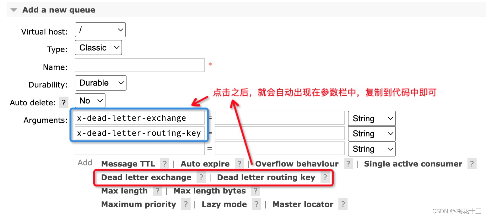


## 5.6 延迟队列
延迟队列，也叫延时队列，是一种消息队列，消息在发送之后，会延迟一定时间再被消费。

### 5.6.1 延迟队列的定义
延时队列，首先，它是一种队列，队列意味着内部的元素是有序的，元素出队和入队是有方向性的，元素从一端进入，从另一端取出。

其次，延时队列，最重要的特性就体现在它的延时属性上，跟普通的队列不一样的是，普通队列中的元素总是等着希望被早点取出处理，而延时队列中的元素则是希望被在指定时间得到取出和处理，所以延时队列中的元素是都是带时间属性的，通常来说是需要被处理的消息或者任务。

简单来说，延时队列就是用来存放需要在指定时间被处理的元素的队列。

### 5.6.2 延迟队列的使用场景
考虑一下以下场景：
1. 订单在十分钟之内未支付则自动取消。
2. 新创建的店铺，如果在十天内都没有上传过商品，则自动发送消息提醒。
3. 账单在一周内未支付，则自动结算。
4. 用户注册成功后，如果三天内没有登陆则进行短信提醒。
5. 用户发起退款，如果三天内没有得到处理则通知相关运营人员。
6. 预定会议后，需要在预定的时间点前十分钟通知各个与会人员参加会议。

### 5.6.3 RabbitMQ中的TTL
先介绍一下RabbitMQ中的一个高级特性——TTL（Time To Live）。

TTL是什么呢？TTL是RabbitMQ中一个消息或者队列的属性，表明一条消息或者该队列中的所有消息的最大存活时间，单位是毫秒。换句话说，如果一条消息设置了TTL属性或者进入了设置TTL属性的队列，那么这条消息如果在TTL设置的时间内没有被消费，则会成为“死信”（至于什么是死信，请翻看上一篇）。如果同时配置了队列的TTL和消息的TTL，那么较小的那个值将会被使用。

那么，如何设置这个TTL值呢？有两种方式:

- 第一种是在创建队列的时候设置队列的“x-message-ttl”属性，这样所有被投递到该队列的消息都最多不会存活超过6s。
```java
Map<String, Object> args = new HashMap<String, Object>();
args.put("x-message-ttl", 6000);
channel.queueDeclare(queueName, durable, exclusive, autoDelete, args);
```
- 另一种方式便是针对每条消息设置TTL,这样这条消息的过期时间也被设置成了6s
```java
AMQP.BasicProperties.Builder builder = new AMQP.BasicProperties.Builder();
builder.expiration("6000");
AMQP.BasicProperties properties = builder.build();
channel.basicPublish(exchangeName, routingKey, mandatory, properties, "msg body".getBytes());
```

这两种方式是有区别的，如果设置了队列的TTL属性，那么一旦消息过期，就会被队列丢弃，而第二种方式，消息即使过期，也不一定会被马上丢弃，因为消息是否过期是在即将投递到消费者之前判定的，如果当前队列有严重的消息积压情况，则已过期的消息也许还能存活较长时间。

还需要注意的一点是，如果不设置TTL，表示消息永远不会过期，如果将TTL设置为0，则表示除非此时可以直接投递该消息到消费者，否则该消息将会被丢弃。


# 6 整合Springboot

## 6.1 启动服务后自动创建交换机等

### 6.1.1 通过配置类实现
在配置类中添加以下内容后，则队列等会自动创建。
```java
@EnableRabbit
@Configuration
public class RabbitMQConfig {
}
```
当生产者发送第一条消息，或者消费者接收到消息后，队列等会自动创建。


### 6.1.2 通过配置RabbitAdmin类实现


# 参考资料
- ~~[RabbitMQ详解，用心看完这一篇就够了【重点】](https://blog.csdn.net/weixin_42039228/article/details/123493937)~~
- ~~[RabbitMQ六种工作模式与应用场景](https://blog.csdn.net/weixin_43452467/article/details/124988506)~~
- [RabbitMQ教程](https://www.tizi365.com/course/1.html)
- ~~[SpringBoot整合RabbitMQ实现六种工作模式](https://segmentfault.com/a/1190000042233182)~~
- ~~[SpringBoot整合rabbitMQ 启动服务后便自动创建交换机，队列，绑定关系等](https://blog.csdn.net/qq_41712271/article/details/115675092)~~
- ~~[RabbitMQ 自动创建队列/交换器/绑定](https://cloud.tencent.com/developer/article/1668606)~~
- ~~[如何在rabbitmq中实现一个生产者，多个消费者，多个消费者都能收到同一条消息](https://blog.csdn.net/weixin_43757027/article/details/124615895)~~
- ~~[中间件系列一 RabbitMQ之安装和Hello World Demo](https://blog.csdn.net/hry2015/article/details/79016854)~~
- ~~[中间件系列三 RabbitMQ之交换机的四种类型和属性](https://blog.csdn.net/hry2015/article/details/79118804)~~
- ~~[中间件系列四 RabbitMQ之Fanout exchange（扇型交换机）之发布订阅](https://blog.csdn.net/hry2015/article/details/79144038)~~
- ~~[【RabbitMQ】一文带你搞定RabbitMQ死信队列](https://mfrank2016.github.io/breeze-blog/2020/05/04/rabbitmq/rabbitmq-how-to-use-dead-letter-queue/)~~
- ~~[【RabbitMQ】一文带你搞定RabbitMQ延迟队列](https://www.cnblogs.com/mfrank/p/11260355.html)~~
- ~~[RabbitMQ高级：死信队列详解](https://blog.csdn.net/w15558056319/article/details/123505899)~~
- ~~[RabbitMQ死信队列在SpringBoot中的使用](https://juejin.cn/post/6844904120030085134)~~

