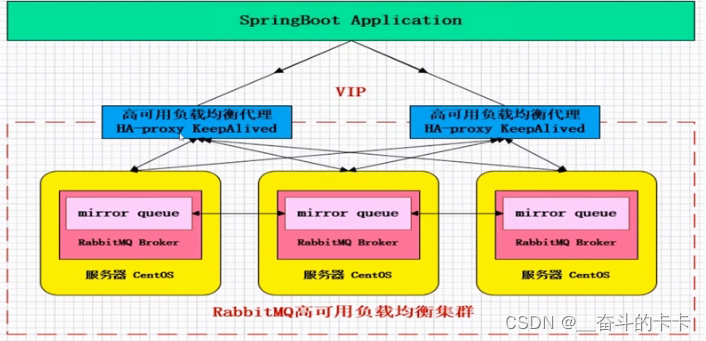

[toc]
>SpringBoot整合RabbitMQ

# 1 RabbitMQ简介
RabbitMQ是一个开源的AMQP（Advanced Message Queuing Protocol）消息中间件，由Erlang语言编写。

了解RabbitMQ前，我们先了解什么是MQ。

## 1.1 MQ
MQ（Message Queue）消息队列，是一个消息的缓冲池，消息的发送者（Producer）将消息发送到消息队列，消息的接收者（Consumer）从消息队列中取出消息。

MQ的主要作用是：
1. 降低系统耦合度。
2. 流量削峰填谷。
3. 异步处理。

## 1.2 常用的消息中间件
现在实现MQ的有两种主流方式：AMQP、JMS。

AMQP，即Advanced Message Queuing Protocol，一个提供统一消息服务的应用层标准高级消息队列协议，是应用层协议的一个开放标准，为面向消息的中间件设计。基于此协议的客户端与消息中间件可传递消息，并不受客户端/中间件不同产品，不同的开发语言等条件的限制。Erlang中的实现有RabbitMQ等。

JMS即Java消息服务（Java Message Service）应用程序接口，是一个Java平台中关于面向消息中间件（MOM）的API，用于在两个应用程序之间，或分布式系统中发送消息，进行异步通信。Java消息服务是一个与具体平台无关的API，绝大多数MOM提供商都对JMS提供支持。

## 1.3 AMQP和JMS的区别
AMQP和JMS都是消息中间件，但是它们在消息传递方面存在一些差异。AMQP是一种应用层协议，JMS是Java平台中提供的API。AMQP支持多种消息传递模式，如点对点、发布/订阅等，而JMS只支持点对点模式。AMQP
支持多种传输协议，如TCP、UDP、HTTP等。

## 1.4 常见的MQ产品
1. ActiveMQ: Apache出品，基于Java语言开发(JMS)，支持多种消息传递模式，支持多种传输协议。
2. RabbitMQ: Erlang出品，基于Erlang语言开发(AMQP)，支持多种消息传递模式，支持多种传输协议。
3. RocketMQ: 阿里出品，基于Java语言开发(JMS)，支持多种消息传递模式，支持多种传输协议。
4. Kafka: LinkedIn出品，基于Scala语言开发，支持多种消息传递模式，支持多种传输协议。分布式消息系统，高吞吐量，低延迟，高可用。

### 1.4.1 ActiveMQ
ActiveMQ是一个开源的JMS消息中间件，它基于Java语言开发.

单机吞吐量是万级，一些小的项目已经够用了，但对于高并发的互联网项目完全不够看。

高可用上，使用的主从架构的实现。

消息可靠性上，有较低的概率会丢失数据。

综合以上，其实这个产品基本可以弃用掉了，完全可以使用RabbitMQ来代替它。

### 1.4.2 RabbitMQ
RabbitMQ是一个开源的AMQP消息中间件，它基于Erlang语言开发.

单机吞吐量也是万级，对于需要支持特别高的并发的情况，它是无法担当重任的。

在高可用上，它使用的是镜像集群模式，可以保证高可用。

在消息可靠性上，它是可以保证数据不丢失的，这也是它的一大优点。

也支持一些消息中间件的高级功能，如：消息重试、死信队列等。

### 1.4.3 RocketMQ
RocketMQ是一个开源的分布式消息中间件，它基于Java语言开发.

它支持高吞吐量，能达到10万级，能承受互联网项目高并发的挑战。

在高可用上，它使用的是分布式架构，可以搭建大规模集群，性能很高。
在消息可靠性上，通过配置，可以保证数据的绝对不丢失。
同时它支持大量的高级功能，如：延迟消息、事务消息、消息回溯、死信队列等等。

它非常适合应用于java系统架构中，因为它使用java语言开发的，我们可以去阅读源码了解更深的底层原理。

目前来看，它没有什么特别的缺点，可以支持高并发下的技术挑战，可以基于它实现分布式事务，大型互联网公司和中小型公司都可以选择使用它来作为消息中间件使用，如果我来做技术选型，我首选的中间件就是它。

### 1.4.4 Kafka
Kafka是一个开源的分布式消息系统，它基于Scala语言开发.

kafka的吞吐量被公认为中间件中的翘楚，单机可以支持十几万的并发，相当强悍。

在高可用上同样支持分布式集群部署。

在消息可靠性上，如果保证异步的性能，可能会出现消息丢失的情况，因为它保存消息时是先存到磁盘缓冲区的，如果机器出现故障，缓冲区的数据是可能丢失的。

它的功能非常的单一，就是消息的接收与发送，因此不适合应用于许多场景。

它在行业内主要应用于大数据领域，使用它进行用户行为日志的采集和计算，来实现比如“猜你喜欢”的功能。

所以，如果没有大数据的需求，一般不会选择它。

## 1.5 为什么选择RabbitMQ
1、ActiveMQ，性能不是很好，因此在高并发的场景下，直接被pass掉了。它的Api很完善，在中小型互联网公司可以去使用。
2、kafka，主要强调高性能，如果对业务需要可靠性消息的投递的时候。那么就不能够选择kafka了。但是如果做一些日志收集呢，kafka还是很好的。因为kafka的性能是十分好的。
3、RocketMQ，它的特点非常好。它高性能、满足可靠性、分布式事物、支持水平扩展、上亿级别的消息堆积、主从之间的切换等等。MQ的所有优点它基本都满足。但是它最大的缺点：商业版收费。因此它有许多功能是不对外提供的。

## 1.6 RabbitMQ介绍
RabbitMQ是由erlang语言开发，基于AMQP（Advanced Message Queue 高级消息队列协议）协议实现的消息队列，它是一种应用程序之间的通信方法，消息队列在分布式系统开发中应用非常广泛。

### 1.6.1 特点
RabbitMQ是使用Erlang语言开发的开源消息队列系统，基于AMQP协议来实现。
AMQP的主要特征是面向消息、队列、路由（包括点对点和发布/订阅）、可靠性、安全。

AMQP协议更多用在企业系统内，对数据一致性、稳定性和可靠性要求很高的场景，对性能和吞吐量的要求还在其次。

RabbitMQ的可靠性是非常好的，数据能够保证百分之百的不丢失。可以使用镜像队列，它的稳定性非常好。所以说在我们互联网的金融行业。对数据的稳定性和可靠性要求都非常高的情况下，我们都会选择RabbitMQ。当然没有kafka性能好，但是要比AvtiveMQ性能要好很多。也可以自己做一些性能的优化。

RabbitMQ可以构建异地双活架构，包括每一个节点存储方式可以采用磁盘或者内存的方式。

### 1.6.2 RabbitMQ的集群架构

非常经典的 mirror 镜像模式，保证 100% 数据不丢失。在实际工作中也是用得最多的，并且实现非常的简单，一般互联网大厂都会构建这种镜像集群模式。

mirror 镜像队列，目的是为了保证 rabbitMQ 数据的高可靠性解决方案，主要就是实现数据的同步，一般来讲是2 - 3个节点实现数据同步。对于100%数据可靠性解决方案，一般是采用 3 个节点。

如上图所示，用 KeepAlived 做了 HA-Proxy 的高可用，然后有 3 个节点的 MQ 服务，消息发送到主节点上，主节点通过 mirror 队列把数据同步到其他的MQ节点，这样来实现其高可靠。

这就是RabbitMQ整个镜像模式的集群架构。

RabbitMQ集群架构参考：[RabbitMQ的4种集群架构](https://www.jianshu.com/p/b7cc32b94d2a)

# 2 RabbitMQ的工作原理介绍
首先先介绍一个简单的一个消息推送到接收的流程，提供一个简单的图：

黄色的圈圈就是我们的消息推送服务，将消息推送到 中间方框里面也就是 rabbitMq的服务器，然后经过服务器里面的交换机、队列等各种关系将数据处理入列后，最终右边的蓝色圈圈消费者获取对应监听的消息。

下图是RabbitMQ的基本结构：

组成部分说明：
- Broker：消息队列服务进程，此进程包括两个部分：Exchange和Queue
- Queue：消息队列，存储消息的队列，消息到达队列并转发给指定的消费者
- Producer：消息生产者，即生产方客户端，生产方客户端将消息发送
- Consumer：消息消费者，即消费方客户端，接收MQ转发的消息。
- Server：接收客户端的连接，实现AMQP实体服务。
- Connection：连接，应用程序与Server的网络连接，TCP连接。
- Channel：信道，消息读写等操作在信道中进行。客户端可以建立多个信道，每个信道代表一个会话任务。
- Message：消息，应用程序和服务器之间传送的数据，消息可以非常简单，也可以很复杂。有Properties和Body组成。Properties为外包装，可以对消息进行修饰，比如消息的优先级、延迟等高级特性；Body就是消息体内容。
- Virtual Host：虚拟主机，用于逻辑隔离。一个虚拟主机里面可以有若干个Exchange和Queue，同一个虚拟主机里面不能有相同名称的Exchange或Queue。
- Exchange：交换器，接收消息，按照路由规则将消息路由到一个或者多个队列，对消息进行过虑。。如果路由不到，或者返回给生产者，或者直接丢弃。RabbitMQ常用的交换器常用类型有direct、topic、fanout
  、headers四种，后面详细介绍。
- Binding：绑定，交换器和消息队列之间的虚拟连接，绑定中可以包含一个或者多个RoutingKey。
- RoutingKey：路由键，生产者将消息发送给交换器的时候，会发送一个RoutingKey，用来指定路由规则，这样交换器就知道把消息发送到哪个队列。路由键通常为一个“.”分割的字符串，例如“com.rabbitmq”。

生产者发送消息流程：
1. 生产者和Broker建立TCP连接。
2. 生产者和Broker建立通道。
3. 生产者通过通道消息发送给Broker，由Exchange将消息进行转发。
4. Exchange将消息转发到指定的Queue（队列）

消费者接收消息流程：
1. 消费者和Broker建立TCP连接
2. 消费者和Broker建立通道
3. 消费者监听指定的Queue（队列）
4. 当有消息到达Queue时Broker默认将消息推送给消费者。
5. 消费者接收到消息。
6. ack回复

整个消息的发布与消费的流程大致如下：
1. 生产者client端指定服务端地址以及vhost虚拟主机，连接服务端
2. 建立连接后，创建Channel信道，设置此信道的属性。
3. 通过信道，声明交换机，队列，绑定关系，以及相关属性
4. 通过信道，发送Message消息到Exchange交换机
5. 交换机通过binding绑定关系与RoutingKey路由键，将消息分发到对应的Queue队列
6. 消费者client通过服务端地址以及vhost连接服务端
7. 建立连接后，创建信道，设置信道属性
8. 通过信道，开启消费者监听队列，从队列中获取消息进行消费
9. 根据是否延迟确认，确认消息已经被正常消费成功后，消息从队列中删除

# 3 RabbitMQ交换机类型
生产者发送消息，并不是直接发送到队列的，而是发送到Exchange交换机，再由交换机分发到相应队列，没有匹配到队列则丢弃消息。根据Exchange的类型不同，可灵活实现常见的消息模式。

## 3.1 Direct exchange（直连交换机）
直连型交换机（direct exchange）是完全匹配型交换机，此种类型交换机，通过RoutingKey路由键将交换机和队列进行绑定， 消息被发送到exchange时，需要根据消息的RoutingKey，来进行匹配，只将消息发送到完全匹配到此RoutingKey的队列。，步骤如下：

1. 将一个队列绑定到某个交换机上，同时赋予该绑定一个路由键（routing key）
2. 当一个携带着路由值为R的消息被发送给直连交换机时，交换机会把它路由给绑定值同样为R的队列。

如图，不同的key绑定不同的队列，实现不同消息分发至不同队列。

注意同一个key，可以绑定多个queue队列。如图中，当匹配到key1时，则会将消息分发送至queue1和queue2，这样两个队列都会有相同的消息数据。

## 3.2 Fanout exchange（扇型交换机）
扇型交换机（funout exchange）将消息路由给绑定到它身上的所有队列。不同于直连交换机，路由键在此类型上不启任务作用。如果N个队列绑定到某个扇型交换机上，当有消息发送给此扇型交换机时，交换机会将消息的发送给这所有的N个队列

# 参考资料
- [RabbitMQ详解，用心看完这一篇就够了【重点】](https://blog.csdn.net/weixin_42039228/article/details/123493937)